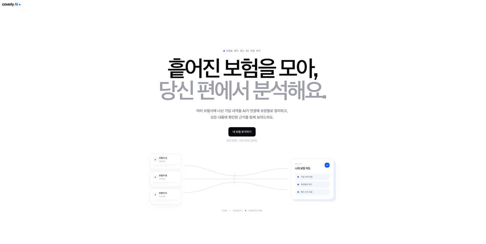
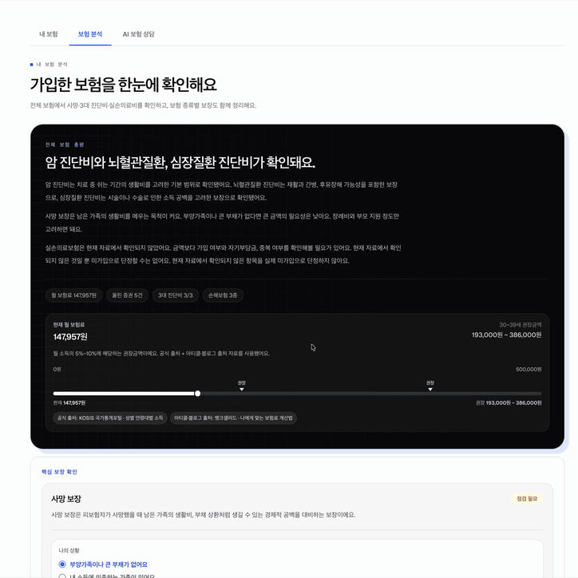
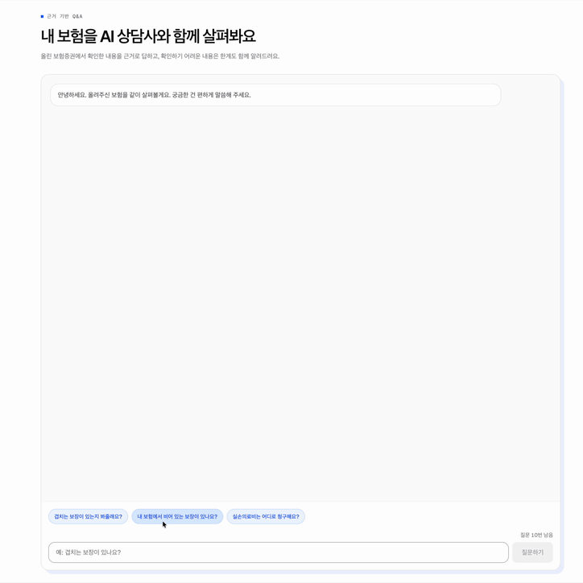
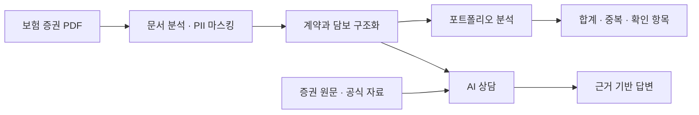
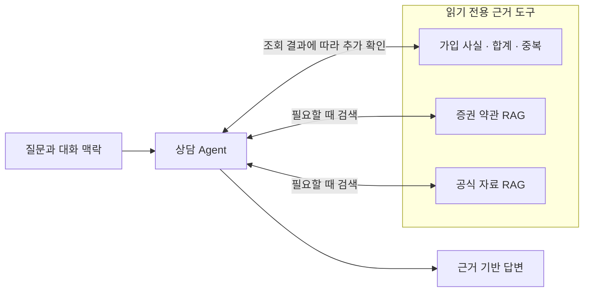

# Coverly

Coverly는 가입한 보험을 이해하도록 돕는 AI 보험 분석 서비스입니다.

보험 증권 PDF를 올리면 계약과 담보를 정리하고, 여러 증권에 흩어진 보장을 한곳에서 비교합니다. 합산할 수 있는 보장과 따로 봐야 하는 보장을 구분하고, 궁금한 내용은 증권 원문과 공식 자료를 근거로 답합니다.

Coverly가 서려는 자리는 보험을 파는 판매원이 아니라, 이미 가입한 보험을 사용자 편에서 함께 살펴보는 AI 상담사입니다. 새 상품을 권하기보다 겹치는 것·불필요한 것·비어 있는 것을 먼저 확인하고, 최종 판단은 사용자에게 남깁니다.

## 서비스 화면

<p align="center">
  
</p>

<table align="center" width="90%">
  <tr>
    <td width="50%" align="center"><strong>보험 분석</strong></td>
    <td width="50%" align="center"><strong>AI 상담</strong></td>
  </tr>
  <tr>
    <td align="center"></td>
    <td align="center"></td>
  </tr>
  <tr>
    <td align="center"><sub>흩어진 보장과 중복·확인 항목을 한눈에 정리합니다.</sub></td>
    <td align="center"><sub>증권과 공식 자료를 근거로 질문에 답합니다.</sub></td>
  </tr>
</table>

## 무엇을 하나요

- PDF에서 보험 종류, 계약 정보, 담보명, 가입금액을 추출합니다.
- 여러 증권의 보장금액을 모으되, 정액형과 실손형처럼 지급 방식이 다른 보장은 구분합니다.
- 겹치는 보장, 확인이 필요한 항목, 자동차·운전자·여행자·화재보험 점검 항목을 보여줍니다.
- 업로드한 증권과 공식 약관·제도 자료를 근거로 보험 질문에 답합니다.
- 근거가 부족하면 추측하지 않고 확인할 수 없다고 안내합니다.



## 어떻게 신뢰할 수 있는 답을 만드나요

### 상담 Agent는 구조화된 사실을 조회합니다

PDF를 구조화할 때는 결정적 파싱과 근거를 검증하는 LLM fallback을 함께 사용합니다. 이후 상담 Agent는 저장된 구조화 사실과 검색 근거를 읽기 전용 도구로 조회합니다. 합계와 중복 여부는 서버 코드가 계산하며, Agent에는 직접 계산하지 않고 조회 결과를 인용하도록 지시합니다.

- 합산 가능한 정액형 담보만 더합니다.
- 실손형 보장은 단순 합산하지 않습니다.
- 같은 담보가 한 보험사에서 반복되거나 여러 행의 보험사를 확인할 수 없으면, 단계형 보장일 가능성이 있어 합산하지 않고 확인 항목으로 분리합니다.
- 이름이 비슷한 담보는 자동 선택하지 않고 후보를 보여줍니다.
- 기준금액과 참고 범위는 출처와 기준일이 있는 참조 데이터에서 가져옵니다.

### 문서 검색은 목적에 따라 나눕니다

- **Policy RAG**는 사용자가 올린 증권에서 특약, 갱신 조건, 면책 문구를 찾습니다.
- **Official RAG**는 공식 약관과 보험 제도 자료에서 일반적인 기준과 용어 설명을 찾습니다.

가입금액처럼 이미 구조화된 사실은 RAG로 다시 찾지 않습니다. 증권에 없는 지급 조건이나 대기기간도 확인된 사실처럼 말하지 않습니다.

### 개인정보는 마스킹하고 임시 보관합니다

증권과 상담에는 이름, 연락처, 주소, 계약번호 같은 민감정보가 포함될 수 있습니다.

- 구조화 데이터와 Policy RAG 색인을 저장하기 전에 개인정보를 마스킹합니다.
- 상담 질문과 대화 이력도 외부 모델에 보내기 전에 마스킹합니다.
- 브라우저에는 분석 결과를 영구 저장하지 않고 메모리에서만 관리합니다.
- 서버 데이터는 만료되는 포트폴리오 세션에 보관합니다.
- Agents SDK tracing은 비활성화합니다.

현재는 로그인과 사용자 식별 체계가 없어 분석 상태와 세션 토큰을 브라우저 메모리에서만 관리합니다. 따라서 새로고침하면 기존 서버 세션이 남아 있어도 화면에서 다시 연결할 수 없으며, 사용자별 영구 저장도 지원하지 않습니다.

### 실패는 사용자 메시지와 개발자 진단으로 나눕니다

일반 API 오류는 오류 코드와 서버가 만든 요청 ID를 공통 형식으로 반환합니다. QA
스트림도 중간에 실패하면 구조화된 오류 이벤트로 종료합니다. 화면에는 사용자가
이해할 수 있는 설명과 다음 행동만 보여주고, 개발자 진단에는 오류명·코드·요청
ID·상태 코드처럼 개인정보가 아닌 값만 남깁니다. 예외 원문, 증권 내용, 상담 질문은
로그나 브라우저 콘솔에 기록하지 않습니다.

재시도는 모든 실패에 일괄 적용하지 않습니다. 읽기 요청이나 서버가 다시 실행해도
안전하다고 명시한 경우에만 횟수를 제한해 재시도하고, 완료 여부가 모호한 생성·업로드
요청은 자동으로 반복하지 않습니다. 사용자가 직접 재시도할 때는 처리 중·성공·실패
상태가 화면에 드러나도록 합니다.

## 상담을 왜 단일 Agent로 구성했나요

보험 질문은 앞선 대화에 따라 의미가 달라지고, 한 번의 답변에도 가입 사실·증권 약관·공식 자료가 함께 필요할 수 있습니다. Coverly는 질문을 미리 정해진 경로에 넣지 않습니다. 하나의 Agent가 대화 맥락을 이어받아 11개 읽기 전용 도구 중 필요한 도구를 고르고, 조회 결과를 본 뒤 다음 확인 항목을 결정합니다.

단일 Agent가 모든 계산을 맡는 것은 아닙니다. 금액·개수·합계·중복·청구 채널은 결정적 코드가 계산하고, 약관과 공식 자료는 RAG 도구가 근거와 함께 반환합니다. Agent의 자연어 답변에는 이 값을 인용하고 근거가 부족하면 확인할 수 없다고 말하도록 지시합니다.

현재 QA 스트림은 Agent의 자연어 출력을 별도의 구조화 스키마나 사후 필터로 다시 쓰지 않고 그대로 전달합니다. 따라서 코드가 계산한 사실과 읽기 전용 도구가 근거 경계를 제공하지만, 최종 문장의 사실 일치를 런타임에서 기계적으로 보장하지는 않습니다. 숫자·출처·권유 수위의 회귀는 평가 규칙과 사람 검수로 측정하며, 이 한계는 아래 평가 결과와 함께 관리합니다.



## 상담 Agent 품질을 어떻게 측정하나요

상담 품질은 실제 `POST /qa/stream`을 호출하는 라이브 평가로 측정합니다. 평가용 증권만 fixture로 대체하고 Agent, 도구, 스트리밍 경로는 운영 코드와 동일하게 사용합니다.

### 평가셋 구성

현재 평가셋은 **70개 대화·89턴**입니다. 한 대화가 여러 위험을 함께 검증할 수 있어 아래 유형은 중복 집계됩니다.

| 주요 유형   | 대화 |  턴 | 확인하는 실패                             |
| ----------- | ---: | --: | ----------------------------------------- |
| 멀티턴      |   12 |  30 | 지시어 해석, 주제 전환, 앞선 답변 오염    |
| 비문·구어체 |   19 |  22 | 오타, 띄어쓰기, 짧고 불완전한 문장        |
| Grounding   |   11 |  12 | 근거 없는 금액·담보·보험사 생성           |
| 적대적 입력 |    9 |  11 | 거짓 전제, 답변 유도, 신뢰할 수 없는 지시 |
| 범위 판단   |    8 |  14 | 보험 밖 질문 거절, 개인 상황 단정 방지    |
| 특수보험    |    9 |  10 | 자동차·운전자·여행자·화재보험 점검        |

평가는 세 층을 조합합니다.

1. 예상 키워드의 포함·제외 여부와 결정적 규칙으로 출처 표기, 근거 없는 금액, 불완전한 도구 인자를 검사합니다.
2. 전체 품질을 측정할 때는 `--judge`를 켜고, LLM-as-a-Judge로 말투, 조언 수위, 판매 권유, 범위 밖 질문 처리를 평가합니다.
3. 자동 평가가 끝난 뒤에는 사람이 답변을 직접 읽어 실제 오류와 평가기의 오판을 구분해야 합니다.

키워드 검사는 의미가 맞는 다른 표현을 실패로 잡을 수 있고, LLM 심판도 문맥을 다르게 해석하거나 실행마다 판단이 달라질 수 있습니다. 반대로 답변에 존재하는 금액이 실제 근거와 일치하더라도 엉뚱한 담보에 붙었다면 단순 규칙만으로는 찾기 어렵습니다. 그래서 자동 평가는 빠르게 실패 후보를 찾는 도구로 사용하고, 최종 결과는 사람이 검수하는 것을 원칙으로 둡니다.

### 마지막 전체 평가 결과

현재 전체 라이브 평가는 **70개 대화·89턴**을 각 1회 실행했습니다. Agent와 LLM 심판은 `gpt-4o-mini`를 사용했습니다.

| 평가           | 범위                  |                           결과 |
| -------------- | --------------------- | -----------------------------: |
| 자동 평가      | 전체 89턴             | **61턴 통과·28턴 실패(68.5%)** |
| 사람 검수 반영 | 자동 실패 28턴 재판정 |  **82턴 통과·7턴 실패(92.1%)** |

사람이 자동 실패 28턴을 모두 검수한 결과, 21턴은 통과로 판정을 바꿨고 7턴은 실패 판정에 동의했습니다. 올바른 되묻기, 의미가 같은 표현, 근거가 포함된 목록형 답변을 자동 평가가 과도하게 실패 처리한 경우가 많았습니다.

검수 반영 결과는 자동 통과 61턴을 유지하고 사람 검수에서 통과한 21턴을 합산한 **82/89턴(92.1%)**입니다. 자동 평가 기준선과 사람 판정이 포함된 원본, 해석 범위는 [상담 Agent 평가 기록](backend/evals/qa/EVALUATION.md)에 보존했습니다.

<details>
<summary>금액 오류를 막기 위한 답변 형식 실험</summary>

보험 상담에서는 맞는 금액을 엉뚱한 담보에 붙이는 오류가 특히 위험합니다. 예를 들어 암진단비와 수술비를 모두 조회한 뒤, 두 금액의 대상을 바꿔 말하는 경우입니다. 이를 생성 단계에서 기계적으로 막기 위해 두 가지 방식을 실험했습니다.

1. **슬롯 참조**: Agent가 금액을 바로 쓰지 않고 `{담보 ID.금액}` 형태의 검증 토큰을 출력하면, 서버가 실제 조회값과 일치하는 토큰만 자연어 금액으로 바꾸는 방식입니다. 금액의 출처를 강제로 연결할 수 있지만, 토큰 형식이 조금만 어긋나도 정상 문장까지 삭제됐습니다.
2. **JSON 구조화 출력**: 답변을 자유롭게 쓰는 대신, 일반 문장과 사실 참조를 구분한 JSON 목록으로만 출력하게 하는 방식입니다. 파싱은 쉬워졌지만 Agent가 형식을 맞추는 과정에서 도구를 반복 호출하거나 최종 답변을 끝내지 못했습니다.

| 방식                       | 답변 완료 | 평가 통과 | 새로 생긴 실패                  |
| -------------------------- | --------: | --------: | ------------------------------- |
| 슬롯 참조                  |     72/72 |     30/72 | 정상 답변 일부 삭제 22턴        |
| JSON 구조화 출력           |     57/72 |     34/57 | 15턴 미완료·답변 일부 삭제 16턴 |
| 자유 문장 + 사후 평가 검사 |     72/72 |     59/72 | 형식 강제로 인한 실패 없음      |

형식 안전장치가 막으려던 금액 오류보다 새로 만든 실패가 더 많았습니다. 현재는 Agent가 도구의 값을 인용해 자연어로 답하게 두고, 평가 단계에서 답변의 모든 숫자가 증권 데이터나 해당 턴의 도구 결과에 실제로 존재하는지 검사합니다. 이 72턴 실험과 위 89턴 전체 평가는 서로 다른 평가셋이므로 전후 성능으로 직접 비교하지 않습니다.

</details>

## RAG를 어떻게 평가했나요

RAG는 검색 결과가 좋다고 최종 답변까지 좋은 것이 아닙니다. 반대로 최종 답변이 틀렸다고 검색부터 바꾸면 원인을 가릴 수 있습니다. 그래서 Policy RAG와 Official RAG를 각각 네 단계로 나눠 측정합니다.

| 단계       | 분리해서 확인하는 것                                      |
| ---------- | --------------------------------------------------------- |
| Extraction | 원문이 PII를 노출하지 않는 인용 가능한 chunk로 변환되는가 |
| Retrieval  | 질문에 필요한 근거가 상위 검색 결과에 들어오는가          |
| Generation | 고정된 근거만으로 인용·거절·금지 표현 계약을 지키는가     |
| E2E        | 실제 검색 결과가 최종 답변까지 올바르게 연결되는가        |

오프라인에서는 결정적 검색과 생성기로 빠르게 회귀를 확인합니다. 운영 검색 효과는 generation을 고정한 채 pgvector retrieval만 바꿔 측정하고, 마지막에 실제 retrieval과 LLM generation을 함께 실행합니다. 결과에는 corpus/index fingerprint와 모델, 평균·p95 지연을 남겨 서로 다른 조건의 점수를 섞지 않습니다.

### 비용 없이 반복하는 로컬 회귀

로컬 평가는 OpenAI API와 운영 DB를 사용하지 않습니다. `HashingEmbedder`와 고정된 추출식 생성기로 같은 입력에 같은 결과를 내므로, 코드 변경 후 검색과 답변 계약이 깨졌는지 빠르게 확인하는 기준선입니다.

| 대상         | Extraction | Offline Retrieval | Deterministic E2E |
| ------------ | ---------: | ----------------: | ----------------: |
| Official RAG |    120/120 |    40/48 (83.3%)¹ |   56/138 (40.6%)² |
| Policy RAG   |      57/57 |   115/122 (94.3%) |   124/171 (72.5%) |

¹ Official Retrieval은 같은 질문에 답할 수 있는 대체 공식 근거까지 인정한 결과입니다. ² Official Deterministic E2E는 문장을 재구성하지 않는 추출식 생성기의 한계로 필수 의미 누락과 답변 가능성 판정 실패가 크게 잡히므로, 운영 답변 품질로 해석하지 않습니다.

평가 규칙과 RAG runner를 검증하는 테스트도 **61/61** 통과했습니다. 이는 평가 구현이 의도대로 동작하는지 확인한 결과이며, 제품 품질 점수와는 구분합니다.

### 운영·라이브 기준선

| 대상         | 운영 Retrieval |             Live Generation |      Online E2E |
| ------------ | -------------: | --------------------------: | --------------: |
| Official RAG |          48/48 |                       53/54 | 103/138 (74.6%) |
| Policy RAG   |        120/122 | practice 85.1% · test 85.0% | 135/171 (78.9%) |

운영 Retrieval은 OpenAI embedding과 pgvector를, Live Generation은 실제 LLM을 사용합니다. 위 기준선은 기존 전체 평가 기록이며 이번 문서 점검에서는 API 비용이 큰 운영·라이브 평가를 다시 실행하지 않았습니다.

Official RAG의 운영 검색은 필요한 citation을 모두 찾았지만 Online E2E는 74.6%에 머물렀습니다. 남은 실패는 검색 누락보다, 검색한 근거의 필수 내용을 답변에 빠뜨리거나 범위 밖 질문을 `answered`로 처리하는 generation 경계에 집중됐습니다. 따라서 retrieval 점수가 높다는 이유로 RAG가 완성됐다고 보지 않습니다.

### 평가하면서 내린 결정

- **top-k를 무작정 늘리지 않습니다.** Official RAG에서 필요한 근거는 더 들어왔지만 context noise도 늘어 E2E 점수가 개선되지 않았습니다.
- **negative 질문의 no-hit 비율을 검색 품질의 주 점수로 쓰지 않습니다.** 검색은 후보를 찾고, 최종 거절은 generation과 QA 전체 경로가 책임집니다.
- **평가 정답을 runtime 규칙으로 옮기지 않습니다.** 특정 상품·질문 전용 매핑 대신 일반적인 표현 차이와 grounding만 보완합니다.
- **PII 마스킹과 검색 품질을 함께 봅니다.** Policy RAG에서는 주소 변경 안내문을 실제 주소로 오인해 근거를 지우던 문제를 고치면서 실제 주소 마스킹은 유지했습니다.
- **컴포넌트와 E2E를 함께 봅니다.** 검색, 생성, 전체 흐름 중 어디가 병목인지 확인한 뒤 한 조건만 바꿉니다.

## 이 프로젝트에서 배운 것

Coverly를 개발하면서 AI 기능 자체만큼 평가와 검토, 기록하는 방식이 중요하다는 것을 느꼈습니다. 특히 AI와 함께 작업할 때는 결과를 빠르게 만드는 것보다, 그 결과가 맞는지 계속 확인할 수 있는 과정이 필요했습니다.

### 1. 평가는 무엇보다 중요합니다

RAG든 Agent든 하나의 성능 점수만 확인해서는 실제 품질을 알기 어려웠습니다. 검색, 생성, 도구 선택, 질문 해석처럼 단계를 나누고 어느 지점에서 무엇이 잘못됐는지 확인해야 개선할 대상을 정확히 찾을 수 있었습니다.

### 2. LLM을 활용한 평가에도 사람의 검토가 필요합니다

AI를 사용하면 평가셋을 빠르게 만들고 LLM-as-a-Judge로 많은 답변을 효율적으로 검사할 수 있습니다. 하지만 키워드 검사와 LLM 심판은 의미가 맞는 답변을 실패로 보거나, 실제 오류가 있는 답변을 통과시키기도 했습니다. 따라서 자동 평가는 실패 후보를 찾는 데 활용하되, 최종 결과와 개선 방향은 사람이 답변을 직접 읽고 확인해야 합니다.

### 3. AI와 코딩할수록 프롬프트와 결과를 꼼꼼히 봐야 합니다

프로젝트 중간부터 검토를 가볍게 여기면 작은 오류와 잘못된 가정이 다음 작업의 전제가 됐습니다. 그렇게 쌓인 문제는 나중에 더 많은 시간과 비용을 들여 되돌려야 했습니다. AI가 작성한 코드와 문서, 제가 입력한 프롬프트 모두 작업 단위마다 확인하는 습관이 중요했습니다.

### 4. `AGENTS.md`와 `CLAUDE.md`는 최소한으로 시작하는 편이 좋습니다

처음부터 완벽한 지침을 만들거나 많은 규칙을 담으려 하면 실제로 사용하지 않는 내용까지 문서에 쌓이기 쉽습니다. 꼭 필요한 원칙만 두고 시작한 뒤, 프로젝트를 진행하면서 각 지침이 실제로 도움이 되는지 확인하고 하나씩 보완하는 편이 유지보수하기 좋았습니다.

### 5. AI가 맥락과 작업 기록을 확인할 수 있도록 문서를 남겨야 합니다

주요 의사결정, 구현 배경, 진행 상황, 시행착오를 기록해 두면 AI가 다음 작업에서도 프로젝트의 맥락을 더 정확하게 파악할 수 있었습니다. 작업의 연속성이 높아지고, 같은 내용을 다시 설명하거나 이미 실패한 접근을 반복하는 일도 줄일 수 있었습니다.

### 6. 작업에 맞는 모델을 선택하는 것이 중요합니다

항상 가장 성능이 높은 모델을 사용하는 것이 가장 효율적이지는 않았습니다. 작업이 길어질수록 비용과 처리 시간이 커졌고, 단순한 수정이나 반복 작업은 가벼운 모델을 사용해도 코드 품질 차이가 크지 않았습니다. 작업의 난이도와 실패 비용을 기준으로 모델을 선택하는 것이 전체 개발 속도와 비용을 관리하는 데 더 효과적이었습니다.

## 기술 스택

| 영역         | 기술                                                                           |
| ------------ | ------------------------------------------------------------------------------ |
| 프론트엔드   | Next.js App Router, React, TypeScript, Tailwind CSS, shadcn/ui, TanStack Query |
| 백엔드       | FastAPI, Python 3.12, Pydantic, uv                                             |
| AI·RAG       | OpenAI, OpenAI Agents SDK, LlamaIndex, pgvector                                |
| 데이터베이스 | PostgreSQL, Supabase                                                           |
| 검증         | Vitest, pytest, ruff, mypy, ESLint, OpenAPI 타입 검사, 라이브 평가             |

## 로컬 실행

Python 3.12, `uv`, Node.js, `pnpm`, pgvector가 활성화된 PostgreSQL이 필요합니다.

```bash
cp backend/.env.example backend/.env

cd backend
uv sync
```

`backend/.env`에 `OPENAI_API_KEY`, `DATABASE_URL`, `POLICY_RAG_SESSION_SECRET`을 설정합니다. 그다음 `supabase/migrations/`를 순서대로 적용하고, 필수 참조 데이터를 준비합니다. 참조 데이터는 저장소에 seed로 복제하지 않으므로 [backend/REFERENCE_DATA.md](backend/REFERENCE_DATA.md)의 새 환경 초기화 절차를 따릅니다.

공식문서 RAG를 사용하는 환경에서는 index를 한 번 생성한 뒤 백엔드를 실행합니다.

```bash
uv run python -m app.rag.official.indexing
uv run uvicorn app.main:app --reload
```

다른 터미널에서 프론트엔드를 실행합니다.

```bash
cd frontend
pnpm install
pnpm dev
```

프론트엔드는 기본적으로 `http://localhost:8000`의 백엔드에 연결하며, 다른 주소를 사용하면 `NEXT_PUBLIC_API_BASE_URL`을 설정합니다. 한 포트폴리오에는 PDF를 최대 5개까지 추가할 수 있고, 파일당 최대 크기는 10MB, 최대 페이지 수는 100쪽입니다.

Render 무료 인스턴스처럼 유휴 상태에서 백엔드가 잠들 수 있는 환경에서는 업로드 전에
`/ready`를 제한된 시간 동안 확인해 프로세스와 세션 저장소가 준비될 시간을 줍니다.
`/health`는 프로세스 생존만 확인하고, `/ready`는 데이터베이스와 세션 저장소 연결까지
확인합니다.

## 검증

```bash
# backend
cd backend
uv run ruff check .
uv run ruff format --check .
uv run mypy .
uv run pytest

# frontend
cd ../frontend
pnpm api:check
pnpm test
pnpm lint
pnpm typecheck
pnpm format:check
pnpm build
```

상담과 RAG 라이브 평가 실행 방법은 [backend/evals/README.md](backend/evals/README.md)를 참고합니다. 데이터 소유권과 세션 만료 규칙은 [backend/REFERENCE_DATA.md](backend/REFERENCE_DATA.md), LLM 프롬프트 원칙은 [backend/PROMPTING.md](backend/PROMPTING.md)에 정리되어 있습니다.

## 현재 과제와 로드맵

| 단계       | 해결할 문제                                                       | 목표                                           |
| ---------- | ----------------------------------------------------------------- | ---------------------------------------------- |
| **현재**   | 자동 실패 28턴 검수 완료, 21턴이 사람 기준 통과로 변경            | 평가 rubric 보완과 자동 통과 사례 표본 검수    |
| **다음**   | 잘못된 보험사 전제, 가입 개수 오류, 담보 오귀속, 과도한 가입 권유 | 사실 검증 규칙과 도구 선택·출처 표현 안정화    |
| **그다음** | 긴 보고서식 답변과 모호한 질문 처리                               | 상담 말투 개선과 평가셋 보강                   |
| **이후**   | 새로고침 후 분석 복원과 사용자별 영구 저장 미지원                 | PII 원칙을 유지하는 로그인·장기 보관 모델 설계 |
