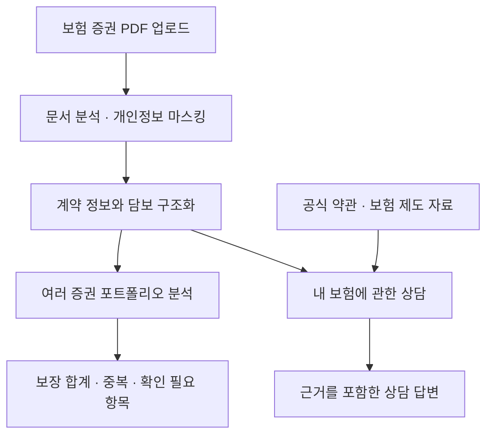
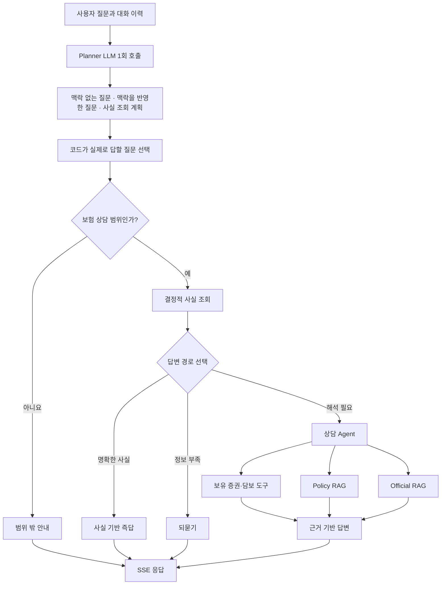
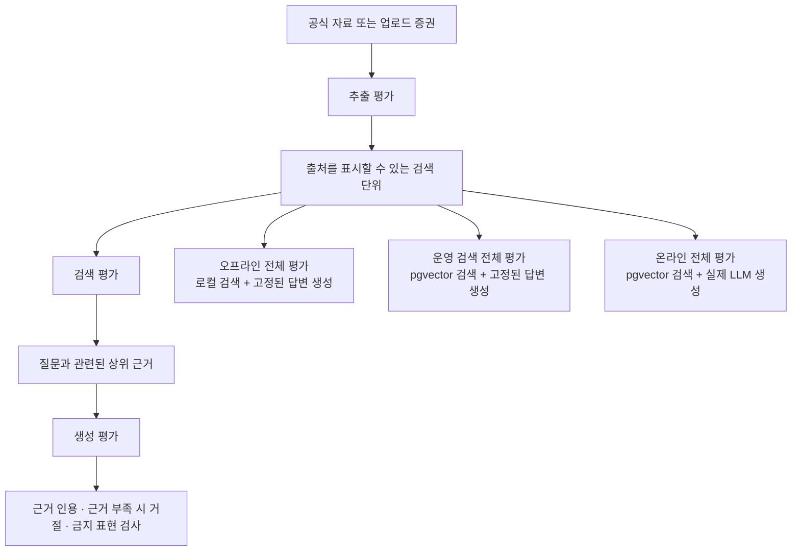

# Coverly

Coverly는 보험 증권 PDF를 분석하는 AI 보험 분석 서비스입니다. 보장 내용을 구조화하고, 여러 보험에서 겹치는 보장을 찾습니다. 확인이 필요한 부분도 근거와 함께 보여줍니다.

보험은 가입한 뒤에도 이해하기 어렵습니다. **담보**는 보험이 보장하는 항목을 뜻합니다. 이름이 비슷해도 지급 조건은 다를 수 있습니다.

여러 증권을 함께 보면 중복 여부를 판단하기가 더 어려워집니다. Coverly는 새 보험을 추천하기보다, 이미 가입한 보험부터 이해하도록 돕습니다.

## 주요 기능

- 보험 증권 PDF에서 보험 종류, 기본 정보, 담보명, 가입금액을 추출합니다.
- 여러 증권을 함께 분석해 합산 가능한 보장과 중복 확인이 필요한 보장을 구분합니다.
- 업로드한 증권과 공식 약관/제도 자료를 근거로 보험 상담 질문에 답합니다.
- 근거가 부족한 보장 판단은 단정하지 않고 확인 불가로 처리합니다.

## 서비스 동작 방식

사용자가 보험 증권을 올리면 서버가 계약 정보와 담보를 추출합니다. 이 과정에서 개인정보를 마스킹합니다. 추출한 데이터는 포트폴리오 분석과 상담의 공통 근거가 됩니다.

상담 중 보험 제도나 약관 설명이 필요할 수도 있습니다. 이 경우에는 공식 자료에서 근거를 추가로 검색합니다.



## 핵심 구현

### 1. 상담 페이지 AI Agent

“내 암진단비가 얼마야?”는 가입금액을 조회하면 답할 수 있습니다. 반면 “이 특약이 지금 상황에도 적용돼?”는 증권과 공식 자료를 확인해야 합니다.

모든 질문을 대규모 언어 모델(LLM)에 맡기지는 않았습니다. 간단한 질문까지 느려지고, 모델이 보험 사실을 추측할 수 있기 때문입니다.

상담 흐름은 질문 계획, 사실 조회, 설명으로 나뉩니다. `planner`가 질문의 범위와 작업을 정합니다. 계산 가능한 사실은 정해진 규칙을 따르는 코드가 조회합니다. 해석이 필요한 질문만 AI Agent가 처리합니다.

멀티턴에서는 앞선 맥락이 필요한 질문과 새로운 주제를 구분해야 합니다. 예를 들어 “그거 얼마야?”는 이전 대화가 필요합니다. `planner`는 맥락을 제외한 질문과 반영한 질문을 모두 만듭니다. 이후 코드가 실제로 답할 질문을 선택합니다.

- 가입금액·보유 담보·청구 채널은 LLM이 만들지 않고 코드가 조회합니다.
- 담보명의 띄어쓰기와 표기 차이는 정규화합니다. 유사한 이름은 자동 선택하지 않고 후보로만 제시합니다.
- `planner`가 사용자가 말하지 않은 담보를 추론할 수 있습니다. 이때 금액을 확정하지 않고 Agent가 해석하도록 넘깁니다.
- Agent 도구는 증권·담보 조회, 합계·중복 확인, Policy RAG, Official RAG로 분리했습니다.
- 답변은 Server-Sent Events(SSE)로 스트리밍하며, 프론트엔드는 생성된 스키마로 이벤트와 정상 종료 여부를 검증합니다.



상담 품질 평가는 실제 상담 API를 반복 실행합니다. 실제 사용자 증권 대신 평가용 증권을 사용합니다. 결과는 **안정 통과·불안정·항상 실패**로 나눕니다. 계획과 도구 호출도 기록해 실패 단계를 찾습니다. 판매 권유 금지와 범위 밖 질문 거절도 함께 확인합니다.

**현재 한계:** 여러 턴의 대명사와 생략 표현은 해석이 불안정할 수 있습니다. 질병·상황과 담보를 연결하는 질문도 마찬가지입니다.

### 2. RAG 평가 체계

Coverly는 답변에 필요한 근거에 따라 두 종류의 RAG를 사용합니다.

- **Official RAG**는 공식 약관과 보험 제도 자료를 검색합니다. 일반적인 보험 기준이나 약관의 의미를 설명할 때 사용합니다. 예를 들면 “실손보험은 어떤 경우에 보장돼?”와 같은 질문입니다.
- **Policy RAG**는 사용자가 올린 증권을 검색합니다. 증권에 실제로 적힌 문구를 확인할 때 사용합니다. 예를 들면 “내 증권에 적힌 갱신 조건이 뭐야?”와 같은 질문입니다.

가입금액처럼 구조화된 사실은 RAG 없이 조회합니다. Policy RAG는 구조화하지 못한 특약·갱신 문구를 찾습니다. 증권에 없는 지급 조건·면책·대기기간은 확인했다고 단정하지 않습니다. 이때는 Official RAG의 일반 기준과 구분해 설명합니다.

두 RAG는 검색 대상과 실패 위험이 다릅니다. 따라서 평가도 분리했습니다.

평가는 다음 네 단계로 구성했습니다.

- **추출 평가:** PDF나 공식 문서가 출처를 표시할 수 있는 검색 단위로 변환되는지 확인합니다.
- **검색 평가:** 질문에 필요한 근거가 상위 검색 결과에 포함되는지 확인합니다.
- **생성 평가:** 근거를 고정하고 인용, 근거 부족 시 거절, 금지 표현을 확인합니다.
- **전체 흐름 평가:** 실제 검색 결과를 답변 생성까지 연결해 사용자가 받는 최종 응답을 확인합니다.

Policy RAG 평가 데이터에는 개인정보 원문을 넣지 않습니다. `[전화번호]`, `[주민등록번호]` 같은 마스킹 토큰을 사용합니다.



오프라인 평가는 빠른 회귀 확인에 사용합니다. 운영 검색 평가는 pgvector 검색만 측정합니다. 온라인 평가는 검색과 실제 LLM 생성을 함께 측정합니다. 한 번에 하나의 조건만 바꿔 실패 원인을 분리합니다.

### 3. 포트폴리오 세션과 민감정보 경계

보험 증권에는 이름, 연락처, 주소, 계약번호가 포함될 수 있습니다. Coverly는 최초 업로드 때 문서를 처리하고 임시 세션을 만듭니다. 이후 요청은 증권 원문을 다시 보내지 않습니다. 세션 토큰과 문서 ID로 구조화 데이터를 조회합니다.

- **가입금액 합산:** 담보를 정액형·실손형·확인 필요로 분류합니다. 이름과 금액의 의미를 확인할 수 있는 정액형 담보만 합산합니다.
- **중복 보장 구분:** 실손형 담보는 중복 가입 여부를 따로 보여줍니다. 손해보험과 자동차보험도 별도 영역으로 분리해 단순 합산으로 생길 수 있는 오해를 줄입니다.
- **브라우저 데이터 관리:** 분석 데이터와 증권 원문은 브라우저 저장소에 남기지 않고 메모리에서만 관리합니다. 새로고침·창 닫기에는 손실 경고를 보여주고, 분석 페이지를 벗어나면 상태를 비웁니다.
- **개인정보 마스킹:** 서버는 구조화 데이터와 Policy RAG 색인을 저장하기 전에 개인정보를 마스킹합니다. 상담 질문과 이력도 외부 모델에 보내기 전에 마스킹합니다. 대상은 주민등록번호, 전화번호, 이메일입니다.
- **외부 추적 차단:** Agents SDK의 tracing 기능을 비활성화했습니다. 대화와 도구 결과가 별도 저장소로 전송되는 것을 막기 위한 조치입니다.

**현재 한계:** 새로고침 이후에는 분석 상태를 복원할 수 없습니다. 브라우저에 민감정보를 남기지 않기 위한 선택입니다. 현재는 로그인과 사용자별 영구 저장도 제공하지 않습니다.

## 기술 스택

| 영역 | 기술 |
|---|---|
| 프론트엔드 | Next.js App Router, React, TypeScript, Tailwind CSS, shadcn/ui, TanStack Query, Vercel Analytics |
| 백엔드 | FastAPI, Python 3.12, Pydantic, uv |
| AI/RAG | OpenAI, OpenAI Agents SDK, LlamaIndex, pgvector |
| 데이터베이스 | PostgreSQL/Supabase |
| 품질 검증 | Vitest, pytest, ruff, mypy, ESLint, OpenAPI 타입 검사, RAG 평가 |

## 실행 방법

### 사전 준비

- Python 3.12 이상, `uv`, Node.js, `pnpm`, pgvector가 활성화된 PostgreSQL이 필요합니다.
- `backend/.env.example`을 `backend/.env`로 복사합니다. 이후 `OPENAI_API_KEY`, `DATABASE_URL`, `POLICY_RAG_SESSION_SECRET`을 설정합니다.
- 핵심 분석과 상담에는 데이터베이스 스키마가 필요합니다. `supabase/migrations`를 적용하고 Official RAG 검색용 색인(index)을 준비해야 합니다.
- 프론트엔드는 기본적으로 `http://localhost:8000`에 연결합니다. 백엔드 주소가 다르면 `NEXT_PUBLIC_API_BASE_URL`을 설정합니다.

### 백엔드

```bash
cd backend
uv sync
uv run uvicorn app.main:app --reload
```

### 프론트엔드

```bash
cd frontend
pnpm install
pnpm dev
```

## 검증

```bash
cd backend
uv run ruff check .
uv run ruff format --check .
uv run mypy .
uv run pytest
```

```bash
cd frontend
pnpm api:check
pnpm test
pnpm lint
pnpm typecheck
pnpm format:check
pnpm build
```

RAG 평가의 실행 방법은 [backend/evals/README.md](backend/evals/README.md)에 정리되어 있습니다. 다음 명령은 API 키 없이 빠른 회귀를 확인합니다.

```bash
cd backend
uv run python -m evals.rag.official.e2e \
  --retrieval-mode offline --generation-mode deterministic
uv run python -m evals.rag.policy.e2e \
  --retrieval-mode offline --generation-mode deterministic
```
