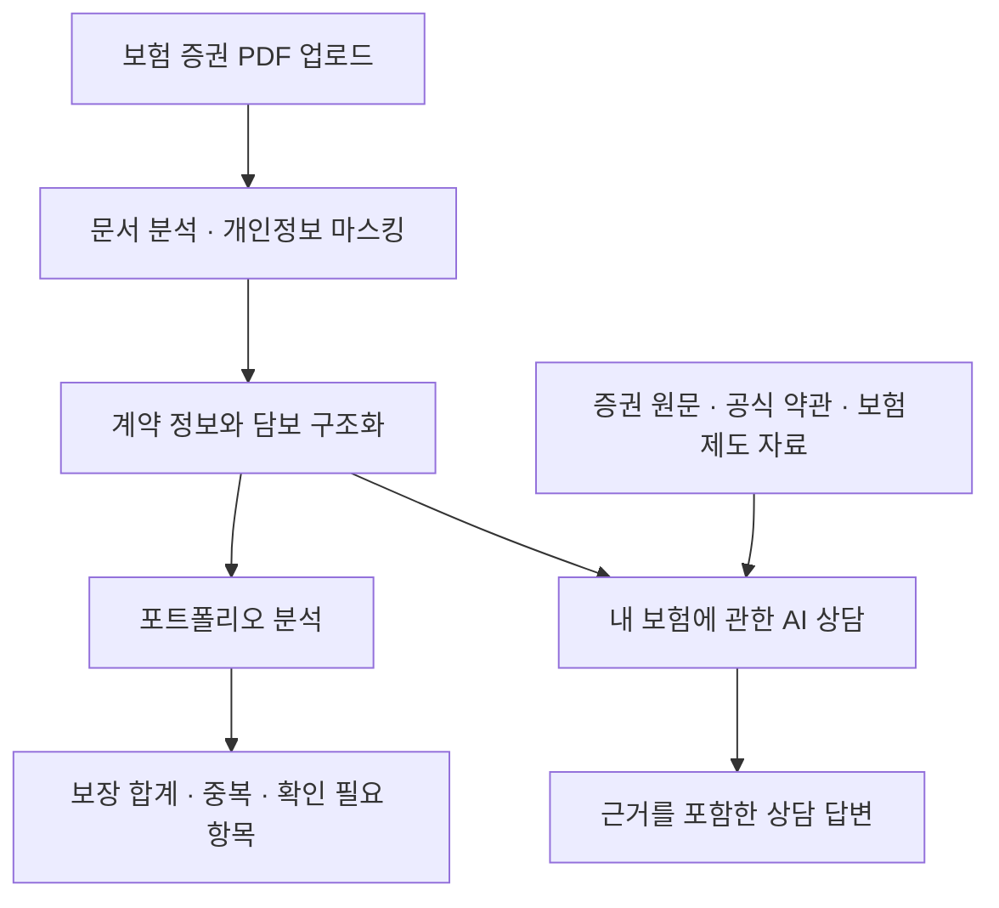
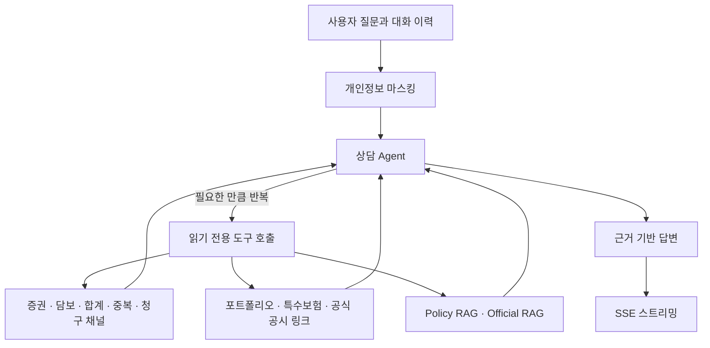
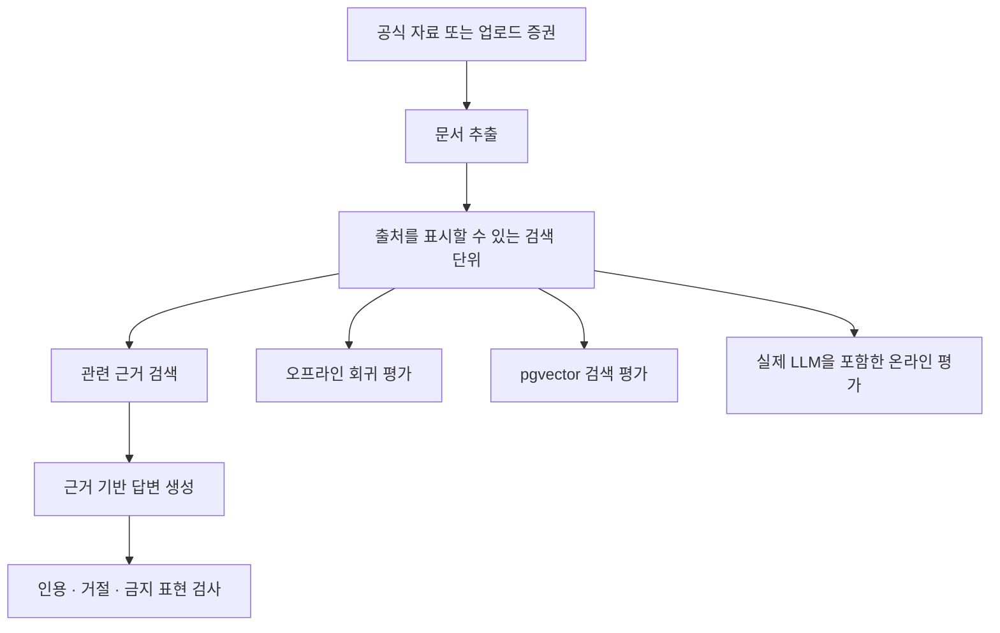

# Coverly

Coverly는 가입한 보험을 이해하도록 돕는 AI 보험 분석 서비스입니다.

사용자가 보험 증권 PDF를 올리면 계약과 담보 정보를 정리합니다. 여러 증권에 흩어진 보장도 한곳에서 비교합니다. 겹치는 보장, 부족할 수 있는 부분, 추가 확인이 필요한 항목을 근거와 함께 보여줍니다.

여기서 **담보**는 보험이 보장하는 항목을 뜻합니다. 이름이 비슷해도 지급 조건은 다를 수 있습니다. 여러 증권을 함께 살펴볼 때는 단순히 금액을 더해서도 안 됩니다.

Coverly는 새 보험을 권하는 판매원이 아닙니다. 이미 가입한 보험을 사용자 편에서 살펴보는 AI 상담사를 지향합니다. 판단 근거를 보여주되, 최종 결정은 사용자에게 남깁니다.

## 주요 기능

- 보험 증권 PDF에서 보험 종류, 계약 정보, 담보명, 가입금액을 추출합니다.
- 여러 증권을 분석해 합산 가능한 보장과 확인이 필요한 보장을 구분합니다.
- 정액형과 실손형의 차이를 반영해 중복 보장을 설명합니다.
- 업로드한 증권과 공식 자료를 근거로 보험 관련 질문에 답합니다.
- 근거가 부족하면 추측하지 않고 확인할 수 없다고 안내합니다.
- 개인정보를 저장하거나 외부 모델에 보내기 전에 마스킹합니다.

## 서비스 동작 방식

증권을 업로드하면 서버가 계약 정보와 담보를 구조화합니다. 이 데이터는 포트폴리오 분석과 AI 상담의 공통 근거가 됩니다.

가입금액이나 담보 목록은 구조화된 데이터에서 조회합니다. 특약 문구는 업로드한 증권 원문에서 찾습니다. 보험 제도나 일반 약관에 관한 설명이 필요하면 공식 자료를 검색합니다.



## 핵심 구현

### 1. 상담 AI Agent

보험 상담에는 성격이 다른 질문이 함께 들어옵니다.

- “내 암진단비가 얼마야?”는 가입금액을 조회하면 답할 수 있습니다.
- “이 특약이 지금 상황에도 적용돼?”는 증권 문구와 공식 자료를 함께 확인해야 합니다.
- “그거 얼마야?”는 앞선 대화에서 무엇을 가리키는지 해석해야 합니다.

#### 이전 구조의 문제

초기 상담 구조에는 답변을 만들기 전에 질문을 정리하는 단계가 있었습니다. 이 역할을 맡은 AI를 Planner라고 불렀습니다. Planner는 대화에서 사용자가 무엇을 가리키는지 해석하고, 어떤 정보를 조회할지 정했습니다.

예를 들어 사용자가 암진단비를 물은 뒤 “그거 얼마야?”라고 말하면, Planner는 질문을 “암진단비 가입금액이 얼마야?”처럼 바꿨습니다. 이후 코드는 Planner가 정한 계획에 따라 가입금액을 조회했습니다.

문제는 Planner가 실제 조회 결과를 보기 전에 질문의 뜻을 확정한다는 점이었습니다. “그거”를 잘못된 담보로 해석하면 이후 조회가 정확해도 답은 틀렸습니다. 평가에서도 많은 실패가 이 단계에서 시작됐습니다.

현재는 Planner를 없애고 하나의 Agent가 질문 해석과 답변을 함께 처리합니다. Agent는 처음부터 하나의 뜻으로 단정하지 않습니다. 먼저 담보 후보를 찾고, 조회 결과를 확인한 뒤 필요한 정보를 다시 조회할 수 있습니다.

조회할 때는 “그거” 같은 표현을 그대로 사용하지 않습니다. 대화와 조회 결과에서 확인한 담보명으로 풀어서 요청합니다. 질문을 해석하는 일과 근거를 확인하는 일이 하나의 흐름 안에서 이루어집니다.



#### 답변 형식 실험

이전에는 Agent가 금액을 잘못 사용할 가능성을 막기 위해 두 가지 방식을 실험했습니다.

1. **슬롯 참조:** Agent는 금액 대신 번호를 쓰고, 코드가 실제 값을 채웠습니다.
2. **구조화 출력:** 최종 답변을 정해진 JSON 조각으로만 만들게 했습니다.

두 방식은 새로운 문제를 만들었습니다. 슬롯 검사는 정상 문장까지 삭제했습니다. 구조화 출력은 도구 호출이 반복되면서 답변이 끝나지 않는 경우를 늘렸습니다.

그래서 답변을 먼저 제한하기보다 실제 실패를 측정했습니다. 형식 강제를 제거한 뒤, 답변의 금액이 증권이나 해당 턴의 도구 결과에 존재하는지 사후 검사했습니다.

| 방식                       | 답변 완료 | 평가 통과 | 안전장치가 문장을 지운 턴 |
| -------------------------- | --------: | --------: | ------------------------: |
| 슬롯 참조                  |     72/72 |     30/72 |                      22턴 |
| 구조화 출력                |     57/72 |     34/57 |                      16턴 |
| 형식 강제 제거 + 사후 검사 |     72/72 |     59/72 |                      없음 |

평가 결과는 사람이 실제 답변을 읽어 다시 확인했습니다. 막으려던 금액 오귀속보다 안전장치가 답변을 훼손하는 문제가 더 컸습니다. 현재는 답변 생성을 방해하지 않고, 평가 단계에서 근거 없는 금액을 탐지합니다.

#### 도구를 추가한 이유

LLM은 충분한 근거가 있을 때 더 정확하게 답합니다. 이전 구조에는 사용자의 보험을 조회하는 기능이 있었지만, 몇 가지 근거가 빠져 있었습니다.

예를 들어 “보장이 충분한가?”에 답하려면 비교 기준이 필요합니다. “자동차보험에서 무엇을 확인해야 하나?”에는 해당 보험의 점검 결과가 필요합니다. 보험사 공식 자료를 안내하려면 검증된 공시 링크도 있어야 합니다.

이 근거가 없으면 Agent는 모델이 학습한 일반 지식에 기대거나 답변을 거절해야 합니다. 그래서 누락된 근거를 코드가 제공하도록 도구를 보완했습니다.

현재 Agent는 11개의 읽기 전용 도구를 사용합니다.

| 구분        | 도구가 제공하는 근거                                       |
| ----------- | ---------------------------------------------------------- |
| 증권과 담보 | 증권 목록, 담보명 목록, 담보 상세                          |
| 금액과 중복 | 가입금액 합계, 중복 보장                                   |
| 이용 안내   | 보험금 청구 채널                                           |
| 포트폴리오  | 필수 보장 현황, 보험료 합계, 출처가 있는 참고 범위         |
| 특수보험    | 자동차·운전자·여행자·화재보험 점검 결과                    |
| 공식 자료   | 업로드한 증권에 적힌 보험사의 공식 공시 링크               |
| 문서 검색   | 증권 원문을 찾는 Policy RAG, 공식 자료를 찾는 Official RAG |

특히 이번 변경에서는 포트폴리오 참고 기준, 특수보험 점검, 공식 공시 링크를 추가했습니다. Agent가 임의로 기준이나 보험사를 추측하지 않도록 하기 위한 변경입니다.

도구를 추가한 뒤, 새 기능과 실패 가능성을 확인하는 평가 케이스도 보강했습니다. 평가셋은 55개 대화·72턴에서 69개 대화·88턴으로 늘었습니다. 확장한 평가셋으로 전체 상담 평가를 다시 실행했습니다.

공식 공시 링크를 묻는 4개 턴과 보험료 참고 기준을 묻는 2개 턴은 모두 통과했습니다. 특수보험 관련 10개 턴 중 8개도 통과했습니다. 실패한 2개 턴은 도구의 사실이 틀린 경우가 아니었습니다. Agent가 답변에 보험사나 상품명을 출처로 명시하지 않은 경우였습니다.

사실을 만드는 주체와 설명하는 주체도 분리했습니다. 가입금액, 담보명, 합계, 중복 여부는 코드가 계산합니다. Agent는 도구가 돌려준 값을 바탕으로 설명합니다. 담보명은 띄어쓰기와 표기 차이를 정규화합니다. 이름이 비슷한 담보는 자동으로 선택하지 않고 후보로 제시합니다.

### 2. 목적에 따라 분리한 RAG

RAG는 질문과 관련된 문서를 먼저 찾고, 그 문서를 근거로 답변을 만드는 방식입니다. Coverly는 검색 대상이 다른 두 종류의 RAG를 사용합니다.

- **Policy RAG**는 사용자가 업로드한 증권을 검색합니다. 특약, 갱신 조건처럼 증권 원문을 확인해야 할 때 사용합니다.
- **Official RAG**는 공식 약관과 보험 제도 자료를 검색합니다. 일반적인 지급 기준이나 보험 용어를 설명할 때 사용합니다.

가입금액처럼 이미 구조화된 사실은 RAG로 찾지 않습니다. 코드가 세션 데이터에서 직접 조회합니다. 증권에 없는 지급 조건, 면책, 대기기간은 확인된 사실처럼 말하지 않습니다.

두 RAG는 검색 대상과 실패 원인이 다릅니다. 따라서 평가도 다음 네 단계로 나눴습니다.

- **추출 평가:** 문서가 출처를 표시할 수 있는 검색 단위로 변환되는지 확인합니다.
- **검색 평가:** 질문에 필요한 근거가 상위 검색 결과에 포함되는지 확인합니다.
- **생성 평가:** 인용, 근거 부족 시 거절, 금지 표현을 확인합니다.
- **전체 흐름 평가:** 실제 검색 결과가 최종 답변까지 올바르게 연결되는지 확인합니다.



오프라인 평가는 빠른 회귀 확인에 사용합니다. 운영 검색 평가는 pgvector 검색 품질만 측정합니다. 온라인 평가는 검색부터 실제 LLM 답변까지 확인합니다. 한 번에 하나의 조건만 바꿔 실패 원인을 구분합니다.

평가용 Policy RAG 데이터에는 개인정보 원문을 넣지 않습니다. `[전화번호]`, `[주민등록번호]`와 같은 마스킹 토큰을 사용합니다.

### 3. 사실 계산과 확인 필요 항목

Agent가 사용하는 값은 세션 데이터 위에서 코드가 계산합니다. 확실하지 않은 값은 무리하게 숫자로 만들지 않습니다. 대신 확인이 필요한 항목으로 분리합니다.

- **가입금액 합산:** 담보를 정액형, 실손형, 확인 필요로 구분합니다. 합산 가능한 정액형 담보만 더합니다.
- **단계형 담보 분리:** 한 보험사가 같은 이름의 담보를 여러 번 기재했다면 합계에서 제외합니다. 하나의 보장을 단계별로 나눠 적은 것일 수 있기 때문입니다.
- **중복 보장 구분:** 정액형과 실손형의 지급 방식을 구분합니다. 손해보험과 자동차보험도 별도로 살펴봅니다.
- **특수보험 점검:** 자동차·운전자·여행자·화재보험에서 확인할 담보를 항목별로 보여줍니다. 해당 증권이 없으면 보장이 없다고 단정하지 않습니다.
- **공식 공시 링크:** 업로드한 증권에 보험사 이름이 있을 때만 해당 보험사의 링크를 제공합니다.

“보장이 충분한가?”나 “보험료가 적정한가?”에는 비교 기준이 필요합니다. Coverly는 이런 기준을 모델의 기억이나 출처 없는 상수에 맡기지 않습니다. 기준일과 출처가 있는 참조 데이터로 관리합니다.

각 출처에는 신뢰도 등급과 주의사항이 붙습니다. Agent는 참고 기준과 사용자의 현재 상태를 구분해 설명합니다. 자세한 기준은 [backend/REFERENCE_DATA.md](backend/REFERENCE_DATA.md)에서 확인할 수 있습니다.

### 4. 개인정보와 세션 경계

보험 증권에는 이름, 연락처, 주소, 계약번호 같은 민감정보가 포함될 수 있습니다. Coverly는 처음 증권을 처리할 때 임시 세션을 만듭니다. 이후 요청에서는 증권 원문을 다시 보내지 않습니다. 세션 토큰과 문서 ID로 필요한 데이터를 조회합니다.

- **브라우저 저장 제한:** 분석 데이터와 증권 원문은 브라우저 저장소에 남기지 않습니다. 메모리에서만 관리합니다.
- **개인정보 마스킹:** 구조화 데이터와 Policy RAG 색인을 저장하기 전에 개인정보를 마스킹합니다. 상담 질문과 대화 이력도 외부 모델에 보내기 전에 마스킹합니다.
- **외부 추적 차단:** Agents SDK의 tracing을 비활성화했습니다. 대화와 도구 결과가 별도 저장소로 전송되는 것을 막기 위한 조치입니다.

브라우저를 새로고침하면 분석 상태를 복원할 수 없습니다. 민감정보를 브라우저에 남기지 않기 위해 선택한 제약입니다. 현재 로그인과 사용자별 영구 저장도 제공하지 않습니다.

## 품질 평가

상담 품질은 `backend/evals/qa/`에서 측정합니다. 평가용 증권으로 실제 `/qa/stream` API에 여러 턴의 대화를 보냅니다.

- `live.py`는 대화를 실행하고 도구 호출과 답변을 기록합니다.
- `rules.py`는 근거 없는 금액과 불완전한 도구 인자를 결정적으로 검사합니다.
- `judge.py`는 말투, 조언 수위, 판매 권유 금지, 범위 밖 질문 거절을 선택적으로 심사합니다.
- `dataset.json`은 오타, 띄어쓰기 없는 문장, 감정적인 표현, 거짓 전제, 프롬프트 인젝션을 포함합니다.

도구를 추가하면서 평가 데이터셋도 55개 대화·72턴에서 69개 대화·88턴으로 확장했습니다. 새 도구가 필요한 질문과 예상 실패 상황을 추가하기 위해서입니다. 규칙 기반 검사 결과뿐 아니라 실제 답변도 사람이 읽어 확인합니다.

확장한 평가셋으로 전체 상담을 다시 실행한 결과는 다음과 같습니다.

| 항목                     |         결과 |
| ------------------------ | -----------: |
| 전체 평가                |         88턴 |
| 통과                     | 63턴 (71.6%) |
| 실패                     |         25턴 |
| 근거 없는 금액이 나온 턴 |          2턴 |
| LLM 심판에서 실패한 턴   |         16턴 |

실패 원인은 서로 겹칠 수 있습니다. LLM 심판 실패는 상담사다운 말투, 출처 표현, 조언 수준, 모호한 질문 처리 등을 평가합니다.

앞에서 소개한 72턴 실험과 이번 88턴 평가는 평가셋이 다릅니다. 따라서 두 결과를 단순한 전후 성능 비교로 사용하지 않습니다. 72턴 실험은 답변 형식 강제 방식을 비교한 결과입니다. 88턴 평가는 도구와 평가 범위를 확장한 현재 상태를 보여줍니다.

재평가를 통해 도구를 추가하는 것만으로는 충분하지 않다는 점도 확인했습니다. Agent가 도구의 근거를 답변에 명확히 드러내야 합니다. 목록을 그대로 옮기기보다 사용자가 이해하기 쉬운 상담 문장으로 설명하는 것도 필요합니다.

## 현재 한계

- Agent가 합계 도구를 호출하지 않고 간단한 덧셈을 직접 할 수 있습니다.
- “뇌혈관”처럼 여러 담보에 걸치는 표현은 하나의 의미로 뭉뚱그려질 수 있습니다.
- 도구에서 확인한 사실도 답변에 출처를 명시하지 않으면 근거가 불분명해 보일 수 있습니다.
- 보험 목록이나 포트폴리오를 설명할 때 상담보다 보고서에 가까운 말투가 나올 수 있습니다.
- 새로고침 후에는 분석 상태를 복원할 수 없습니다.
- 로그인과 사용자별 영구 저장은 아직 지원하지 않습니다.

## 프로젝트에서 배운 점

- **실패를 먼저 측정해야 합니다.** 문제를 추측해 안전장치를 만들면 새로운 실패를 만들 수 있습니다.
- **평가 결과는 사람이 읽어야 합니다.** 점수만으로는 답변이 왜 좋아지거나 나빠졌는지 알기 어렵습니다.
- **LLM에는 충분한 근거가 필요합니다.** 프롬프트만 다듬기보다 필요한 사실과 출처를 도구로 제공하는 편이 효과적이었습니다.
- **결정의 이유를 문서에 남겨야 합니다.** 코드만으로 드러나지 않는 맥락이 다음 작업의 품질을 높입니다.
- **가이드 문서는 작게 유지합니다.** 실제로 필요한 규칙만 남겨야 문서도 계속 관리할 수 있습니다.

## 기술 스택

| 영역         | 기술                                                                                             |
| ------------ | ------------------------------------------------------------------------------------------------ |
| 프론트엔드   | Next.js App Router, React, TypeScript, Tailwind CSS, shadcn/ui, TanStack Query, Vercel Analytics |
| 백엔드       | FastAPI, Python 3.12, Pydantic, uv                                                               |
| AI/RAG       | OpenAI, OpenAI Agents SDK, LlamaIndex, pgvector                                                  |
| 데이터베이스 | PostgreSQL, Supabase                                                                             |
| 품질 검증    | Vitest, pytest, ruff, mypy, ESLint, OpenAPI 타입 검사, RAG 평가                                  |

## 로컬 실행

### 사전 준비

- Python 3.12 이상, `uv`, Node.js, `pnpm`이 필요합니다.
- pgvector가 활성화된 PostgreSQL이 필요합니다.
- `backend/.env.example`을 `backend/.env`로 복사합니다.
- `OPENAI_API_KEY`, `DATABASE_URL`, `POLICY_RAG_SESSION_SECRET`을 설정합니다.
- `supabase/migrations`를 적용하고 Official RAG 검색 색인을 준비합니다.

프론트엔드는 기본적으로 `http://localhost:8000`의 백엔드에 연결합니다. 주소가 다르면 `NEXT_PUBLIC_API_BASE_URL`을 설정합니다.

### 백엔드

```bash
cd backend
uv sync
uv run uvicorn app.main:app --reload
```

### 프론트엔드

```bash
cd frontend
pnpm install
pnpm dev
```

## 검증

### 백엔드

```bash
cd backend
uv run ruff check .
uv run ruff format --check .
uv run mypy .
uv run pytest
```

### 프론트엔드

```bash
cd frontend
pnpm api:check
pnpm test
pnpm lint
pnpm typecheck
pnpm format:check
pnpm build
```

### 상담 품질 평가

실제 `/qa/stream` API와 LLM을 사용하므로 `OPENAI_API_KEY`가 필요합니다.

```bash
cd backend
uv run python -m evals.qa.live
uv run python -m evals.qa.live --judge
```

### RAG 평가

자세한 실행 방법은 [backend/evals/README.md](backend/evals/README.md)에 정리되어 있습니다. 다음 명령은 API 키 없이 빠른 회귀를 확인합니다.

```bash
cd backend
uv run python -m evals.rag.official.e2e \
  --retrieval-mode offline --generation-mode deterministic
uv run python -m evals.rag.policy.e2e \
  --retrieval-mode offline --generation-mode deterministic
```
