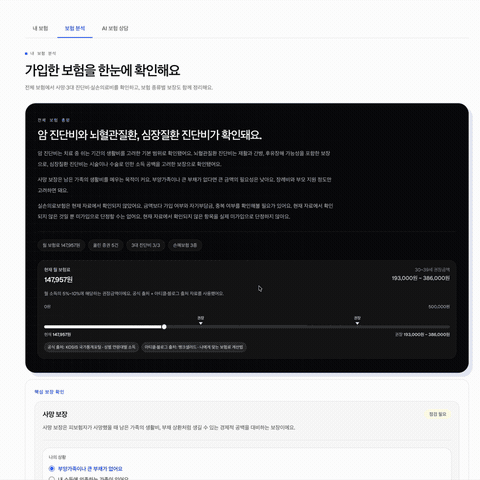
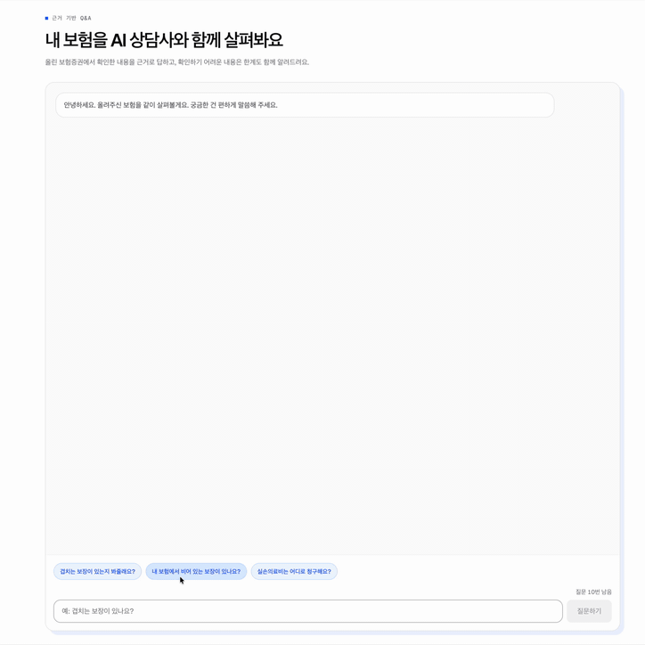
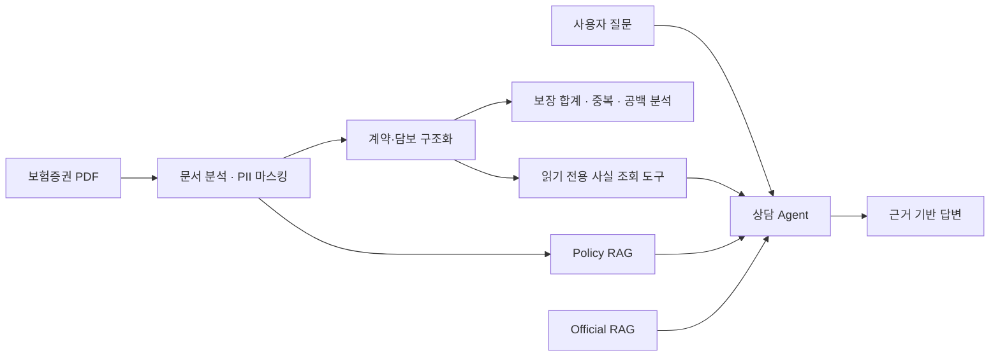
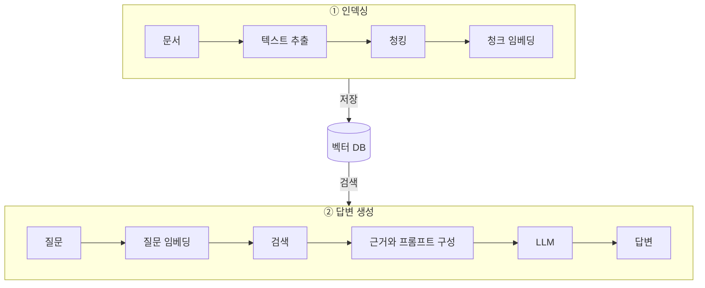

# Coverly

[**Coverly**](https://usecoverly.xyz/)는 여러 보험 증권에 흩어진 계약과 보장 정보를 구조화해 한눈에 비교하고, 증권 원문과 공식 자료에 근거한 AI 상담을 제공하는 보험 분석 서비스입니다. 특정 상품을 권유하기보다 현재 가입한 보험의 중복·공백·확인 사항을 명확히 보여주어 사용자의 합리적인 판단을 돕습니다.

<table align="center" width="90%">
  <tr>
    <td width="50%" align="center"><strong>보험 분석</strong></td>
    <td width="50%" align="center"><strong>AI 상담</strong></td>
  </tr>
  <tr>
    <td align="center"></td>
    <td align="center"></td>
  </tr>
  <tr>
    <td align="center"><sub>흩어진 보장과 중복·확인 항목을 한눈에 정리합니다.</sub></td>
    <td align="center"><sub>증권과 공식 자료를 근거로 질문에 답합니다.</sub></td>
  </tr>
</table>

## 어떤 문제를 해결하고 싶었나요?

### Why 보험?

보험은 여러 보험사에 나누어 가입하는 경우가 많아 **전체 보장 현황과 중복·공백을 한눈에 파악하기 어렵습니다.** 또한 보험 상담이 때로는 추가 가입을 권유하는 과정처럼 느껴지기도 합니다. 가입한 보험을 한곳에 모아 객관적으로 분석하고, **판매 목적 없이 사용자 관점에서 설명하는 서비스**가 필요하다고 생각했습니다.

### Why AI?

보험에 대한 질문은 가입 내용과 대화 맥락에 따라 다르기 때문에 모든 질문과 답변 흐름을 미리 정의하기 어렵습니다. **AI는 사용자의 의도를 이해하고 필요한 정보와 근거를 선택해 설명할 수 있어** 상담 기능에 적합하다고 판단했습니다. 다만 **금액·합계·중복 판단은 서버 코드가 담당**하도록 분리해 AI가 계산 과정에서 잘못된 정보를 생성할 가능성을 줄였습니다.

### Why RAG?

**모델의 일반 지식만으로 보험의 보장 조건과 용어를 정확하게 설명하기 어렵다**고 판단했습니다. 보험증권에는 상세 약관이 충분히 담기지 않는 경우가 있어 표준약관과 공식 보험 지식을 검색하는 **Official RAG**를 구성했습니다. 또한 분석에 필요한 정보만 구조화하는 과정에서 상담에 필요한 원문 내용이 제외될 수 있어, 업로드한 증권 원문을 별도로 검색하는 **Policy RAG**를 설계했습니다.

## 어떻게 동작하나요?


```mermaid
flowchart LR
    PDF["보험증권 PDF"] --> PARSE["문서 분석 · PII 마스킹"]
    PARSE --> FACTS["계약·담보 구조화"]
    PARSE --> POLICY["Policy RAG"]

    FACTS --> ANALYSIS["보장 합계 · 중복 · 공백 분석"]
    FACTS --> TOOLS["읽기 전용 사실 조회 도구"]

    QUESTION["사용자 질문"] --> AGENT["상담 Agent"]
    TOOLS --> AGENT
    POLICY --> AGENT
    OFFICIAL["Official RAG"] --> AGENT
    AGENT --> ANSWER["근거 기반 답변"]
```

**결정적 계산은 서버가 담당**하고, **AI는 확인된 사실과 검색 근거를 바탕으로 설명**합니다.

- **문서 처리** — 개인정보를 마스킹한 뒤 계약·담보·가입금액을 구조화합니다.
- **보장 분석** — 합산 가능한 보장을 계산하고, 실손형이나 근거가 불명확한 항목은 별도로 구분합니다.
- **근거 검색** — Policy RAG는 증권 원문을, Official RAG는 표준약관과 공식 보험 지식을 검색합니다.
- **AI 상담** — Agent가 필요한 사실과 근거를 조회해 답하고, 근거가 부족하면 확인할 수 없다고 안내합니다.

## 핵심 구현과 기술적 고민

### 단일 Agent 기반 상담

보험 상담은 질문에 따라 계약 정보, 보장 합계, 증권 원문, 공식 자료를 조회하고 그 결과에 맞춰 다음 행동을 결정해야 합니다. 이 과정을 직접 구현하는 대신 **OpenAI Agents SDK의 도구 실행 루프와 스트리밍**을 활용했습니다.

여러 Agent로 역할을 나누는 방식도 고려했지만, 하나의 답변에서 여러 근거를 함께 사용해야 하고 현재 11개 도구는 하나의 Agent가 처리할 수 있는 규모라고 판단해 **단일 Agent 구조**를 선택했습니다.

정확성을 위해 **합계와 중복 판단은 서버 코드가 담당하고 Agent는 필요한 도구를 선택해 사실을 조회하고 설명**하도록 분리했지만, AI가 최종 문장을 잘못 생성하는 오류를 완전히 방지했다고 보기는 어렵습니다. 최종 답변의 금액과 판단이 **서버에서 계산한 값과 검색된 근거에 맞는지 확인하는 출력 검증**이 필요할 수 있지만, 실제로 오류를 줄일 수 있는지는 추가 실험이 필요합니다.

<details>
<summary><strong>상담 Agent 검증 결과 보기</strong></summary>

상담 품질은 실제 Agent와 도구 호출 흐름을 사용하는 **70개 대화·89턴의 평가셋**으로 검증했습니다. 자동 평가가 올바른 되묻기나 의미가 같은 표현을 실패로 판단하는 경우가 있어 **사람의 직접 검수가 필요**했습니다.

| 검증 방식 | 결과 | 확인한 내용 |
| --- | ---: | --- |
| 자동 평가 | **61/89턴 통과 (68.5%)** | 근거 없는 금액·담보 생성, 출처 표기, 도구 사용 규칙 |
| 사람 검수 반영 | **82/89턴 통과 (92.1%)** | 자동 실패 28턴을 직접 검토해 실제 오류와 평가기 오판을 구분 |

Agent가 최종 문장을 잘못 생성하는 오류를 방지할 수 있는지 확인하기 위해 슬롯 참조와 JSON 구조화 출력을 실험했습니다. 두 방식 모두 현재 구현보다 결과가 좋지 않아 적용하지 않았습니다. 위 89턴 전체 평가와 72턴 출력 형식 실험은 서로 다른 평가셋이므로 결과를 직접 비교하지 않았습니다.

- **슬롯 참조** — Agent가 금액 대신 사실 ID를 출력하면 서버가 검증된 값으로 치환합니다.

   ```text
   Agent: 암진단비 합계는 {coverage_total.amount:암진단비 합계}입니다.
   서버:  암진단비 합계는 6,000만원입니다.
   ```

- **JSON 구조화 출력** — 일반 문장과 사실 참조를 구분한 JSON을 서버가 문장으로 조합합니다.

   ```json
   [
     {"type": "text", "value": "암진단비 합계는 "},
     {"type": "fact", "id": "coverage_total", "field": "amount"},
     {"type": "text", "value": "입니다."}
   ]
   ```

   `서버: 암진단비 합계는 6,000만원입니다.`

- **현재 구현(자유 문장)** — Agent가 완성된 자연어 답변을 바로 생성합니다.

   ```text
   Agent: 암진단비 합계는 6,000만원입니다.
   ```


| 답변 방식 | 완료 | 평가 통과(완료 답변 기준) | 주요 문제 |
| --- | ---: | ---: | --- |
| 슬롯 참조 | **72/72** | **30/72** | 슬롯 규칙을 어기면 정상 문장까지 삭제되어 답변 누락 |
| JSON 구조화 출력 | **57/72** | **34/57** | JSON 출력을 생성하지 못한 채 도구 호출을 반복해 턴 상한 도달(15턴) |
| 현재 구현(자유 문장) | **72/72** | **59/72** | 출력 정확성을 런타임에서 보장하지 못함 |

</details>

### RAG 구현 및 품질 개선

- **Policy RAG** — 사용자가 업로드한 보험증권 원문을 해당 세션 범위 안에서 검색합니다.
- **Official RAG** — 표준약관과 법령·소비자 안내자료 등 공식 보험 지식을 검색합니다.


```mermaid
flowchart TB
    subgraph INDEX["① 인덱싱"]
        direction LR
        DOC["문서"] --> TEXT["텍스트 추출"]
        TEXT --> CHUNK["청킹"]
        CHUNK --> EMBED["청크 임베딩"]
    end

    DB[("벡터 DB")]

    subgraph ANSWER["② 답변 생성"]
        direction LR
        QUESTION["질문"] --> QEMBED["질문 임베딩"]
        QEMBED --> SEARCH["검색"]
        SEARCH --> PROMPT["근거와 프롬프트 구성"]
        PROMPT --> LLM["LLM"]
        LLM --> RESPONSE["답변"]
    end

    INDEX -->|"저장"| DB
    DB -->|"검색"| ANSWER
```

처음에는 위와 같은 기본 RAG 파이프라인을 구현했습니다. 하지만 최종 답변만 확인해서는 **원문 변환, 검색, 답변 생성 중 어디에서 문제가 발생했는지 구분하기 어려웠습니다.** 이를 확인하기 위해 Extraction·Retrieval·Generation·E2E 평가를 각각 만들고, 실패 지점을 분석해 개선안을 하나씩 적용한 뒤 다시 평가하는 과정을 반복했습니다.

문서 유형별 청킹, 벡터·키워드 검색 결합, query expansion, semantic reranking 등을 비교하며 **현재 평가 기준에서 가장 안정적인 방법만 반영**했습니다. 예를 들어 Official RAG에서 검색 결과를 5개에서 8개로 늘리자 검색 누락은 줄었지만 불필요한 문맥이 늘어 최종 답변의 필수 내용 누락이 증가해 적용하지 않았습니다.

다양한 질문과 실패 사례를 평가셋에 포함하려고 했지만, 평가셋의 구성 자체가 편향되었을 가능성은 남아 있습니다. 따라서 현재 결과만으로 실제 품질을 완전히 보장하기는 어려우며, **평가셋을 지속적으로 확장하고 LLM-as-a-Judge와 사람 검수를 반복해 결과를 확인할 필요가 있습니다.**

<details>
<summary><strong>RAG 검증 결과 보기</strong></summary>

Policy RAG는 과도한 주소 마스킹이 검색 근거까지 제거하는 문제를 수정해 개인정보 보호와 검색 품질을 함께 유지했습니다. Official RAG는 운영 검색이 48/48을 기록했지만 E2E는 74.6%에 머물러, 다음 개선 지점이 검색보다 답변 생성 단계에 있음을 확인했습니다. 두 RAG는 평가셋과 역할이 다르므로 점수를 서로 직접 비교하지 않았습니다.

| RAG | 원문 변환<br>(Extraction) | 운영 검색<br>(Retrieval) | 답변 생성<br>(Generation) | 전체 흐름<br>(E2E) |
| --- | ---: | ---: | ---: | ---: |
| Policy RAG | **57/57 (100%)** | **120/122 (98.4%)** | **80/94 (85.1%)** | **135/171 (78.9%)** |
| Official RAG | **120/120 (100%)** | **48/48 (100%)** | **53/54 (98.1%)** | **103/138 (74.6%)** |

</details>

## 프로젝트를 통해 배운 점

- **평가는 구현만큼 중요했습니다.** 빠르게 평가셋을 만들고 LLM-as-a-Judge를 활용하면 개선 방향을 찾는 데 도움이 되지만, 실제 문제를 이해하려면 사람이 결과를 직접 확인하는 과정이 필요했습니다.
- **AI와 코딩할수록 꼼꼼한 검토와 맥락 관리가 필요했습니다.** 프롬프트와 결과를 가볍게 넘긴 문제는 점차 커졌고, 결정과 작업 맥락을 문서로 남기자 AI가 프로젝트를 일관되게 이해하는 데 도움이 됐습니다. AGENTS.md도 처음부터 많은 규칙을 넣기보다 실제로 효과가 확인된 내용만 추가하는 편이 유지하기 좋았습니다.
- **항상 가장 강한 모델을 사용하는 것이 최선은 아니었습니다.** 작업 난이도에 맞춰 모델을 선택하면 결과의 큰 차이 없이 시간과 비용을 줄일 수 있어, 목적에 맞는 도구 선택이 중요하다는 점을 배웠습니다.

## 기술 스택

| 기술 | 사용한 이유 |
| --- | --- |
| **Next.js · React · TypeScript** | 업로드·분석·상담으로 이어지는 복잡한 화면 상태를 컴포넌트와 타입 기반으로 관리했습니다. |
| **TanStack Query** | 분석 결과와 세션 상태 등 서버 데이터를 일관된 방식으로 조회하고 동기화했습니다. |
| **FastAPI · Pydantic** | Python AI 생태계를 활용하면서 API 계약 검증과 OpenAPI 타입 생성을 함께 처리했습니다. |
| **PostgreSQL · Supabase · pgvector** | 세션·참조 데이터와 벡터 검색 데이터를 하나의 데이터베이스 경계에서 관리했습니다. |
| **OpenAI Agents SDK** | 읽기 전용 도구를 선택해 근거를 조회하고 답변하는 상담 Agent를 구성했습니다. |
| **pytest · Vitest** | 외부 API와 LLM을 대체한 결정적 테스트로 주요 기능의 회귀를 검증했습니다. |

## 로컬 실행

Python 3.12 이상, `uv`, Node.js, `pnpm`, **pgvector를 활성화한 Supabase 프로젝트**와 OpenAI API 키가 필요합니다.

### 환경 설정

```bash
cp backend/.env.example backend/.env
```

`backend/.env`에 다음 값을 설정합니다. 자세한 데이터 경계는 [참조 데이터 초기화 안내](backend/REFERENCE_DATA.md)를 참고합니다.

```dotenv
OPENAI_API_KEY=
DATABASE_URL=
POLICY_RAG_SESSION_SECRET=
```

새 Supabase 프로젝트에서는 `DATABASE_URL`을 셸 환경변수로 설정한 뒤 현재 스키마와 샘플 참조 데이터를 초기화합니다.

```bash
psql "$DATABASE_URL" -v ON_ERROR_STOP=1 -f supabase/bootstrap.sql
psql "$DATABASE_URL" -v ON_ERROR_STOP=1 -f supabase/seed.sql
```

`supabase/migrations/`는 기존 DB의 변경 이력이므로 새 환경에서 처음부터 반복 실행하지 않습니다.

### 백엔드 실행

```bash
cd backend
uv sync
uv run python -m app.rag.official.indexing
uv run uvicorn app.main:app --reload
```

### 프론트엔드 실행

새 터미널에서 실행합니다.

```bash
cd frontend
pnpm install
pnpm dev
```

프론트엔드는 기본적으로 `http://localhost:8000`의 백엔드에 연결됩니다. 다른 주소를 사용하면 `NEXT_PUBLIC_API_BASE_URL`을 설정합니다.

### 샘플 증권으로 확인

`http://localhost:3000`에서 [`sample_policy/`](sample_policy/)의 PDF를 업로드하면 보장 합계·중복 분석과 AI 상담을 확인할 수 있습니다. 네 파일의 구성과 추천 질문은 [샘플 증권 안내](sample_policy/README.md)에 정리되어 있습니다.
