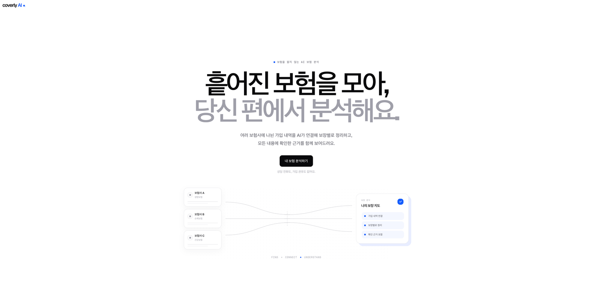
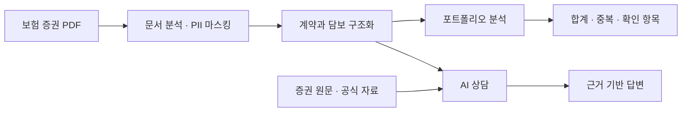
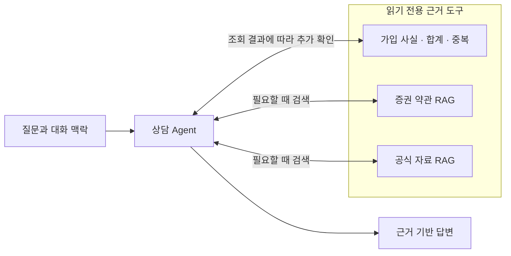

# Coverly

Coverly는 가입한 보험을 이해하도록 돕는 AI 보험 분석 서비스입니다.

보험 증권 PDF를 올리면 여러 증권에 흩어진 보장을 한곳에서 비교하고, 궁금한 내용은 **AI 상담사**가 증권 원문과 공식 자료를 근거로 답합니다.

## 서비스 화면

<p align="center">
  
</p>

<table align="center" width="90%">
  <tr>
    <td width="50%" align="center"><strong>보험 분석</strong></td>
    <td width="50%" align="center"><strong>AI 상담</strong></td>
  </tr>
  <tr>
    <td align="center"></td>
    <td align="center"></td>
  </tr>
  <tr>
    <td align="center"><sub>흩어진 보장과 중복·확인 항목을 한눈에 정리합니다.</sub></td>
    <td align="center"><sub>증권과 공식 자료를 근거로 질문에 답합니다.</sub></td>
  </tr>
</table>

## 무엇을 하나요

- PDF에서 보험 종류, 계약 정보, 담보명, 가입금액을 추출합니다.
- 여러 증권의 보장금액을 모으되, 정액형과 실손형처럼 지급 방식이 다른 보장은 구분합니다.
- 겹치는 보장, 확인이 필요한 항목, 자동차·운전자·여행자·화재보험 점검 항목을 보여줍니다.
- 업로드한 증권과 공식 약관·제도 자료를 근거로 보험 질문에 답합니다.
- 근거가 부족하면 추측하지 않고 확인할 수 없다고 안내합니다.


```mermaid
flowchart LR
    A["보험 증권 PDF"] --> B["문서 분석 · PII 마스킹"]
    B --> C["계약과 담보 구조화"]
    C --> D["포트폴리오 분석"]
    C --> E["AI 상담"]
    F["증권 원문 · 공식 자료"] --> E
    D --> G["합계 · 중복 · 확인 항목"]
    E --> H["근거 기반 답변"]
```

## 어떻게 신뢰할 수 있는 답을 만드나요

### 상담 Agent는 구조화된 사실을 조회합니다

PDF를 구조화할 때는 결정적 파싱과 근거를 검증하는 LLM fallback을 함께 사용합니다. 이후 상담 Agent는 저장된 구조화 사실과 검색 근거를 읽기 전용 도구로 조회합니다. 합계와 중복 여부는 서버 코드가 계산하며, Agent에는 직접 계산하지 않고 조회 결과를 인용하도록 지시합니다.

- 합산 가능한 정액형 담보만 더합니다.
- 실손형 보장은 단순 합산하지 않습니다.
- 한 보험사에서 같은 담보가 여러 줄에 걸쳐 나오거나, 각 줄이 어느 보험사 것인지 확인되지 않으면 합산하지 않습니다. 보장이 단계별로 나뉜 경우일 수 있어 확인 항목으로 따로 뺍니다.
- 이름이 비슷한 담보는 자동 선택하지 않고 후보를 보여줍니다.
- 기준금액과 참고 범위는 출처와 기준일이 있는 참조 데이터에서 가져옵니다.

### 문서 검색은 목적에 따라 나눕니다

- **Policy RAG**는 사용자가 올린 증권에서 특약, 갱신 조건, 면책 문구를 찾습니다.
- **Official RAG**는 공식 약관과 보험 제도 자료에서 일반적인 기준과 용어 설명을 찾습니다.

가입금액처럼 이미 구조화된 사실은 RAG로 다시 찾지 않습니다. 증권에 없는 지급 조건이나 대기기간도 확인된 사실처럼 말하지 않습니다.

## 상담을 왜 단일 Agent로 구성했나요

보험 질문은 앞선 대화에 따라 의미가 달라지고, 한 번의 답변에도 가입 사실·증권 약관·공식 자료가 함께 필요할 수 있습니다. Coverly는 질문을 미리 정해진 경로에 넣지 않습니다. 하나의 Agent가 대화 맥락을 이어받아 11개 읽기 전용 도구 중 필요한 도구를 고르고, 조회 결과를 본 뒤 다음 확인 항목을 결정합니다.

단일 Agent가 모든 계산을 맡는 것은 아닙니다. 금액·개수·합계·중복·청구 채널은 결정적 코드가 계산하고, 약관과 공식 자료는 RAG 도구가 근거와 함께 반환합니다. Agent의 자연어 답변에는 이 값을 인용하고 근거가 부족하면 확인할 수 없다고 말하도록 지시합니다.

현재 QA 스트림은 Agent의 자연어 출력을 별도의 구조화 스키마나 사후 필터로 다시 쓰지 않고 그대로 전달합니다. 따라서 코드가 계산한 사실과 읽기 전용 도구가 근거 경계를 제공하지만, 최종 문장의 사실 일치를 런타임에서 기계적으로 보장하지는 않습니다. 숫자·출처·권유 수위의 회귀는 평가 규칙과 사람 검수로 측정하며, 이 한계는 아래 평가 결과와 함께 관리합니다.


```mermaid
flowchart LR
    Q["질문과 대화 맥락"] --> A["상담 Agent"]

    subgraph TOOLS["읽기 전용 근거 도구"]
        direction TB
        F["가입 사실 · 합계 · 중복"]
        P["증권 약관 RAG"]
        O["공식 자료 RAG"]
    end

    A <-->|"조회 결과에 따라 추가 확인"| F
    A <-->|"필요할 때 검색"| P
    A <-->|"필요할 때 검색"| O
    A --> R["근거 기반 답변"]
```

## 상담 Agent 품질을 어떻게 측정하나요

상담 품질은 실제 `POST /qa/stream`을 호출하는 라이브 평가로 측정합니다. 평가용 증권만 fixture로 대체하고 Agent, 도구, 스트리밍 경로는 운영 코드와 동일하게 사용합니다.

### 평가셋 구성

현재 평가셋은 **70개 대화·89턴**입니다. 한 대화가 여러 위험을 함께 검증할 수 있어 아래 유형은 중복 집계됩니다.

| 주요 유형   | 대화 |  턴 | 확인하는 실패                             |
| ----------- | ---: | --: | ----------------------------------------- |
| 멀티턴      |   12 |  30 | 지시어 해석, 주제 전환, 앞선 답변 오염    |
| 비문·구어체 |   19 |  22 | 오타, 띄어쓰기, 짧고 불완전한 문장        |
| Grounding   |   11 |  12 | 근거 없는 금액·담보·보험사 생성           |
| 적대적 입력 |    9 |  11 | 거짓 전제, 답변 유도, 신뢰할 수 없는 지시 |
| 범위 판단   |    8 |  14 | 보험 밖 질문 거절, 개인 상황 단정 방지    |
| 특수보험    |    9 |  10 | 자동차·운전자·여행자·화재보험 점검        |

평가는 세 층을 조합합니다.

1. 예상 키워드의 포함·제외 여부와 결정적 규칙으로 출처 표기, 근거 없는 금액, 불완전한 도구 인자를 검사합니다.
2. 전체 품질을 측정할 때는 `--judge`를 켜고, LLM-as-a-Judge로 말투, 조언 수위, 판매 권유, 범위 밖 질문 처리를 평가합니다.
3. 자동 평가가 끝난 뒤에는 사람이 답변을 직접 읽어 실제 오류와 평가기의 오판을 구분해야 합니다.

3번이 필요한 이유는 자동 평가가 두 방향 모두로 틀리기 때문입니다. 멀쩡한 답변을 실패로 잡기도 하고 — 키워드 검사는 의미가 같은 다른 표현을 놓치고, LLM 심판은 실행마다 판단이 흔들립니다 — 반대로 진짜 오류를 통과시키기도 합니다. 금액이 실제 근거와 일치하더라도 엉뚱한 담보에 붙어 있으면 단순 규칙으로는 걸러내지 못합니다.

### 마지막 전체 평가 결과

위 평가셋 전체를 각 1회 실행한 결과입니다. 비용 때문에 Agent와 LLM 심판 모두 `gpt-4o-mini`로 돌렸으므로, 제품 기본값(`gpt-4.1-mini`)에서의 점수는 아닙니다.

| 평가           | 범위                  |                           결과 |
| -------------- | --------------------- | -----------------------------: |
| 자동 평가      | 전체 89턴             | **61턴 통과·28턴 실패(68.5%)** |
| 사람 검수 반영 | 자동 실패 28턴 재판정 |  **82턴 통과·7턴 실패(92.1%)** |

자동 실패 28턴을 사람이 모두 검수한 결과 **21턴은 통과로 판정이 바뀌었고 7턴은 실패에 동의**했습니다. 올바른 되묻기, 의미가 같은 표현, 근거가 포함된 목록형 답변을 자동 평가가 과도하게 실패 처리한 경우가 많았습니다. 자동 평가 기준선과 사람 판정이 포함된 원본, 해석 범위는 [상담 Agent 평가 기록](backend/evals/qa/EVALUATION.md)에 보존했습니다.

<details>
<summary>금액 오류를 막기 위한 답변 형식 실험</summary>

보험 상담에서는 맞는 금액을 엉뚱한 담보에 붙이는 오류가 특히 위험합니다. 예를 들어 암진단비와 수술비를 모두 조회한 뒤, 두 금액의 대상을 바꿔 말하는 경우입니다. 이를 생성 단계에서 기계적으로 막기 위해 두 가지 방식을 실험했습니다.

1. **슬롯 참조**: Agent가 금액을 바로 쓰지 않고 `{담보 ID.금액}` 형태의 검증 토큰을 출력하면, 서버가 실제 조회값과 일치하는 토큰만 자연어 금액으로 바꾸는 방식입니다. 금액의 출처를 강제로 연결할 수 있지만, 토큰 형식이 조금만 어긋나도 정상 문장까지 삭제됐습니다.
2. **JSON 구조화 출력**: 답변을 자유롭게 쓰는 대신, 일반 문장과 사실 참조를 구분한 JSON 목록으로만 출력하게 하는 방식입니다. 파싱은 쉬워졌지만 Agent가 형식을 맞추는 과정에서 도구를 반복 호출하거나 최종 답변을 끝내지 못했습니다.

| 방식                       | 답변 완료 | 평가 통과 | 새로 생긴 실패                  |
| -------------------------- | --------: | --------: | ------------------------------- |
| 슬롯 참조                  |     72/72 |     30/72 | 정상 답변 일부 삭제 22턴        |
| JSON 구조화 출력           |     57/72 |     34/57 | 15턴 미완료·답변 일부 삭제 16턴 |
| 자유 문장 + 사후 평가 검사 |     72/72 |     59/72 | 형식 강제로 인한 실패 없음      |

형식 안전장치가 막으려던 금액 오류보다 새로 만든 실패가 더 많았습니다. 현재는 Agent가 도구의 값을 인용해 자연어로 답하게 두고, 평가 단계에서 답변의 모든 숫자가 증권 데이터나 해당 턴의 도구 결과에 실제로 존재하는지 검사합니다. 이 72턴 실험과 위 89턴 전체 평가는 서로 다른 평가셋이므로 전후 성능으로 직접 비교하지 않습니다.

</details>

## RAG를 어떻게 평가했나요

검색 결과가 좋다고 해서 최종 답변까지 좋아지지는 않습니다. 반대로 답변이 틀렸다고 검색부터 손대면 진짜 원인을 가리게 됩니다. 그래서 Policy RAG와 Official RAG를 각각 네 단계로 나눠 측정합니다.

| 단계       | 분리해서 확인하는 것                                      |
| ---------- | --------------------------------------------------------- |
| Extraction | 원문이 PII를 노출하지 않는 인용 가능한 chunk로 변환되는가 |
| Retrieval  | 질문에 필요한 근거가 상위 검색 결과에 들어오는가          |
| Generation | 고정된 근거만으로 인용·거절·금지 표현 계약을 지키는가     |
| E2E        | 실제 검색 결과가 최종 답변까지 올바르게 연결되는가        |

오프라인에서는 결정적 검색과 생성기로 빠르게 회귀를 확인합니다. 운영 검색 효과는 generation을 고정한 채 pgvector retrieval만 바꿔 측정하고, 마지막에 실제 retrieval과 LLM generation을 함께 실행합니다. 결과에는 corpus/index fingerprint와 모델, 평균·p95 지연을 남겨 서로 다른 조건의 점수를 섞지 않습니다.

### 비용 없이 반복하는 로컬 회귀

로컬 평가는 OpenAI API와 운영 DB를 사용하지 않습니다. `HashingEmbedder`와 고정된 추출식 생성기로 같은 입력에 같은 결과를 내므로, 코드 변경 후 검색과 답변 계약이 깨졌는지 빠르게 확인하는 기준선입니다.

**Deterministic E2E는 제품 품질 점수가 아닙니다.** 여기 쓰는 생성기는 문장을 새로 쓰지 못하고 원문을 그대로 뽑아 붙이기 때문에, 실제로는 답에 들어 있는 내용도 누락으로 잡힙니다. 회귀 감지용 기준선으로만 읽어야 하며, 실제 답변 품질은 아래 [운영·라이브 기준선](#운영라이브-기준선)에 있습니다.

| 대상         | Extraction | Offline Retrieval | Deterministic E2E |
| ------------ | ---------: | ----------------: | ----------------: |
| Official RAG |    120/120 |    40/48 (83.3%)¹ |    56/138 (40.6%) |
| Policy RAG   |      57/57 |  recall@5 0.934²  |   124/171 (72.5%) |

¹ Official Retrieval은 같은 질문에 답할 수 있는 대체 공식 근거까지 인정한 결과입니다. ² Policy Offline Retrieval은 통과 건수가 아니라 122개 질의의 평균 recall@5로 기록합니다.

평가 규칙과 RAG runner를 검증하는 테스트도 **61/61** 통과했습니다. 이는 평가 구현이 의도대로 동작하는지 확인한 결과이며, 제품 품질 점수와는 구분합니다.

### 운영·라이브 기준선

| 대상         | 운영 Retrieval |             Live Generation |      Online E2E |
| ------------ | -------------: | --------------------------: | --------------: |
| Official RAG |          48/48 |                       53/54 | 103/138 (74.6%) |
| Policy RAG   |        120/122 | practice 85.1% · test 85.0% | 135/171 (78.9%) |

운영 Retrieval은 OpenAI embedding과 pgvector를, Live Generation은 실제 LLM을 사용합니다. 두 corpus는 실행일이 다릅니다 — **Policy RAG는 2026-07-19, Official RAG는 2026-07-20**(보험약관 개선 로드맵 케이스 제외 후 재측정) 기준이며, 이후 문서를 갱신하면서도 비용이 큰 운영·라이브 평가는 재실행하지 않았습니다.

Official RAG의 운영 검색은 필요한 citation을 모두 찾았지만 Online E2E는 74.6%에 머물렀습니다. 남은 실패는 검색 누락보다, 검색한 근거의 필수 내용을 답변에 빠뜨리거나 범위 밖 질문을 `answered`로 처리하는 generation 경계에 집중됐습니다. **retrieval 점수가 높다는 이유로 RAG가 완성됐다고 보지 않습니다.**

### 평가하면서 내린 결정

- **top-k를 무작정 늘리지 않습니다.** Official RAG에서 필요한 근거는 더 들어왔지만 context noise도 늘어 E2E 점수가 개선되지 않았습니다.
- **negative 질문의 no-hit 비율을 검색 품질의 주 점수로 쓰지 않습니다.** 검색은 후보를 찾고, 최종 거절은 generation과 QA 전체 경로가 책임집니다.
- **평가 정답을 runtime 규칙으로 옮기지 않습니다.** 특정 상품·질문 전용 매핑 대신 일반적인 표현 차이와 grounding만 보완합니다.
- **PII 마스킹과 검색 품질을 함께 봅니다.** Policy RAG에서는 주소 변경 안내문을 실제 주소로 오인해 근거를 지우던 문제를 고치면서 실제 주소 마스킹은 유지했습니다.
- **컴포넌트와 E2E를 함께 봅니다.** 검색, 생성, 전체 흐름 중 어디가 병목인지 확인한 뒤 한 조건만 바꿉니다.

## 기술 스택

| 영역         | 기술                                                                           |
| ------------ | ------------------------------------------------------------------------------ |
| 프론트엔드   | Next.js App Router, React, TypeScript, Tailwind CSS, shadcn/ui, TanStack Query |
| 백엔드       | FastAPI, Python 3.12, Pydantic, uv                                             |
| AI·RAG       | OpenAI, OpenAI Agents SDK, LlamaIndex, pgvector                                |
| 데이터베이스 | PostgreSQL, Supabase                                                           |
| 검증         | Vitest, pytest, ruff, mypy, ESLint, OpenAPI 타입 검사, 라이브 평가             |

## 로컬 실행

> **저장소를 복제하는 것만으로는 실행되지 않습니다.** OpenAI API 키, pgvector가 활성화된 PostgreSQL, 그리고 저장소에 포함하지 않는 참조 데이터를 직접 준비해야 합니다.

Python 3.12, `uv`, Node.js, `pnpm`, pgvector가 활성화된 PostgreSQL이 필요합니다.

```bash
cp backend/.env.example backend/.env

cd backend
uv sync
```

`backend/.env`에 `OPENAI_API_KEY`, `DATABASE_URL`, `POLICY_RAG_SESSION_SECRET`을 설정합니다. 그다음 `supabase/migrations/`를 순서대로 적용하고, 필수 참조 데이터를 준비합니다. 참조 데이터는 저장소에 seed로 복제하지 않으므로 [backend/REFERENCE_DATA.md](backend/REFERENCE_DATA.md)의 새 환경 초기화 절차를 따릅니다.

공식문서 RAG를 사용하는 환경에서는 index를 한 번 생성한 뒤 백엔드를 실행합니다.

```bash
uv run python -m app.rag.official.indexing
uv run uvicorn app.main:app --reload
```

다른 터미널에서 프론트엔드를 실행합니다.

```bash
cd frontend
pnpm install
pnpm dev
```

프론트엔드는 기본적으로 `http://localhost:8000`의 백엔드에 연결하며, 다른 주소를 사용하면 `NEXT_PUBLIC_API_BASE_URL`을 설정합니다. 한 포트폴리오에는 PDF를 최대 5개까지 추가할 수 있고, 파일당 최대 크기는 10MB, 최대 페이지 수는 100쪽입니다.

Render 무료 인스턴스처럼 유휴 상태에서 백엔드가 잠들 수 있는 환경에서는 업로드 전에 `/ready`를 제한된 시간 동안 확인해 프로세스와 세션 저장소가 준비될 시간을 줍니다. `/health`는 프로세스 생존만 확인하고, `/ready`는 데이터베이스와 세션 저장소 연결까지 확인합니다.

## 검증

```bash
# backend
cd backend
uv run ruff check .
uv run ruff format --check .
uv run mypy .
uv run pytest

# frontend
cd ../frontend
pnpm api:check
pnpm test
pnpm lint
pnpm typecheck
pnpm format:check
pnpm build
```

상담과 RAG 라이브 평가 실행 방법은 [backend/evals/README.md](backend/evals/README.md)를 참고합니다. 데이터 소유권과 세션 만료 규칙은 [backend/REFERENCE_DATA.md](backend/REFERENCE_DATA.md), LLM 프롬프트 원칙은 [backend/PROMPTING.md](backend/PROMPTING.md)에 정리되어 있습니다.
