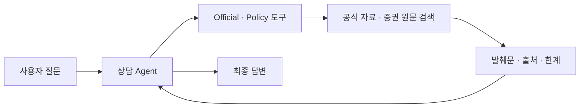

# RAG 근거 전달 실험

## 변경한 이유

기존에는 Official RAG 내부 LLM이 답변을 만든 뒤 상담 Agent가 다시 최종 답변을
작성했다. 같은 내용을 두 번 생성하면서 응답이 느려지고, 두 생성 단계 사이에서
표현이나 판단이 달라질 수 있었다.

이번 실험에서는 Official RAG와 Policy RAG가 **검색 근거·출처·한계만 반환**하고,
상담 Agent가 이를 사용해 한 번만 답변하도록 바꿨다. 기존 generation 구현과
평가는 구성 요소 비교를 위해 유지하지만, 상담 Agent의 운영 경로에서는 호출하지
않는다.

## 변경 전후 결과

같은 Test 세트와 `gpt-4o-mini`, offline retrieval을 사용했다. 규칙 평가는 실행
변동을 보기 위해 각 케이스를 3회 반복했고, Judge 평가는 비용을 고려해 1회
실행했다.

| 지표 | 변경 전 | Official 적용 | Policy까지 적용·리뷰 반영 |
| --- | ---: | ---: | ---: |
| 규칙 평가 통과 | **17/33 (51.5%)** | **19/33 (57.6%)** | **21/33 (63.6%)** |
| 평균 응답 시간 | **8.753초** | **6.500초** | **5.308초** |
| p95 응답 시간 | **18.936초** | **10.176초** | **9.279초** |
| Official 답변 생성 경로 | 사용 | 제거 | 제거 |
| Policy 답변 생성 경로 | 사용 | 사용 | 제거 |
| Judge 평가 통과 | **4/11 (36.4%)** | **3/11 (27.3%)** | **4/11 (36.4%)** |
| Agent 모델 요청 | 미계측 | 미계측 | **65회/33턴** |
| Agent 모델 토큰 | 미계측 | 미계측 | **378,601** |

최종 구조에서는 두 RAG의 내부 LLM 생성이 모두 제거됐다. 평균 응답 시간은 변경
전보다 **3.445초(39.4%)**, p95는 **9.657초(51.0%)** 줄었다. 규칙 평가와 Judge
평가에서 기존보다 낮아지는 품질 회귀도 관찰되지 않았다.

Judge 평가는 단계별 1회만 실행해 작은 차이는 Agent 응답 변동과 구분하기 어렵다.
따라서 이번 결과는 답변 품질 개선의 근거가 아니라, **중복 LLM 호출을 제거하면서
기존 품질 수준을 유지했는지 확인한 결과**로 해석한다.

Agent 요청 수와 토큰은 리뷰 후부터 Agents SDK가 보고한 실제 사용량을 기록한다.
변경 전에는 같은 계측이 없어 총 LLM 호출 수를 직접 비교하지 않는다. 또한 이
offline 결과에는 운영 Official retrieval의 semantic rerank LLM 호출이 포함되지
않으므로, 표는 **RAG 답변 생성 제거와 offline Agent 실행 결과**만 증명한다.

기존 Practice 24개를 1회 실행한 결과는 **10/24 통과**였다. 근거 부족 시 공식
약관 링크를 전달하는 fallback은 별도 도구 호출 없이 같은 결과에 포함해 복구했고,
나머지 실패 대부분은 Agent의 도구 미호출로 이번 호출 제거 범위 밖에 남겼다.

## 확인된 남은 문제

- `적합성 원칙 + 설명의무` 복합 질문에서 검색어가 두 의무를 모두 회수하지 못했다.
- 개인 분쟁의 결과를 묻는 질문에서 Agent가 Official 도구를 호출하지 않고 기간을
  추정했다.
- 일부 Policy 질문에서는 여전히 Policy 도구 선택과 증권 간 근거 구분이 흔들렸다.

이 문제들은 Test 결과를 보고 검색 규칙이나 프롬프트에 맞추지 않았다. 이번 작업은
LLM 호출 제거만 다루므로 **검색 품질과 Agent 도구 선택 개선은 범위 밖**으로 남겼다.

## 재현 정보

| 구분 | 변경 전 | Official 적용 | Policy까지 적용·리뷰 반영 |
| --- | --- | --- | --- |
| 데이터셋 | `2026-07-28-draft-2` | `2026-07-28-draft-2` | `2026-07-28-draft-3` |
| 평가 fingerprint | `ead7fcba59b24a03` | `c637b9f8a2c0b070` | `5f63d8b22519cab0` |
| retrieval | offline | offline | offline |
| 실행 오류 | 0 | 0 | 0 |

`draft-3`는 Practice fallback의 내부 도구 기대만 바꿨으며 Test 질문과 판정 조건은
`draft-2`와 같다. fingerprint는 Agent, 도구, retrieval·reranking, 공통 scoring,
평가 runner까지 실제 실행 경로를 포함한다.
